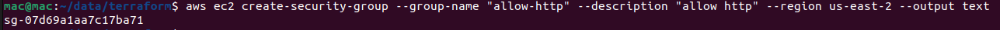

Ví dụ ta dùng Terraform để tạo hạ tầng trên AWS, sau khi Terraform tạo hạ tầng xong thì nó sẽ tạo ra một state file để lưu lại trạng thái của hạ tầng. Nếu có ai đó không dùng Terraform mà truy cập thẳng lên AWS Web Console để thay đổi bất cứ thứ gì liên quan tới hạ tầng của ta, thì lúc này trạng thái của hạ tầng trong state file sẽ khác với hạ tầng thực tế, ta sẽ giải quyết vấn đề này như thế nào trong Terraform?

# Create infrastructure
```
provider "aws" {
  region = "us-east-2"
}

data "aws_ami" "ubuntu" {
  most_recent = true

  filter {
    name   = "name"
    values = ["ubuntu/images/hvm-ssd/ubuntu-focal-20.04-amd64-server-*"]
  }

  owners = ["099720109477"]
}

resource "aws_security_group" "allow_ssh" {
  name   = "allow-ssh"

  ingress {
    from_port = "22"
    to_port   = "22"
    protocol  = "tcp"
    cidr_blocks = [
      "0.0.0.0/0",
    ]
  }

  egress {
    from_port   = 0
    to_port     = 0
    protocol    = "-1"
    cidr_blocks = ["0.0.0.0/0"]
  }

  tags = {
    Name  = "allow-ssh"
  }
}

resource "aws_instance" "server" {
  ami           = data.aws_ami.ubuntu.id
  instance_type = "t2.micro"

  vpc_security_group_ids = [
    aws_security_group.allow_ssh.id
  ]

  lifecycle {
    create_before_destroy = false
  }

  tags = {
    Name  = "Server"
  }
}

output "instance_id" {
  value = aws_instance.server.id
}
```
```
terraform init && terraform apply -auto-approve
```

# Change Infrastructure
Tiếp theo, dùng AWS CLI để tạo Security Group và gán nó vào EC2. Tạo SG.
```
aws ec2 create-security-group --group-name "allow-http" --description "allow http" --region us-east-2 --output text

```

Ta sẽ thấy SG id được in ra terminal, nhớ copy giá trị đó lại.



Cập nhật SG cho phép truy cập port 80
```
aws ec2 authorize-security-group-ingress --group-name "allow-http" --protocol tcp --port 80 --cidr 0.0.0.0/0 --region us-east-2
```

Gán SG vào EC2.
~~~
current_security_groups=$(aws ec2 describe-instances --instance-ids $(terraform output -raw instance_id) --query Reservations[*].Instances[*].SecurityGroups[*].GroupId --region us-east-2 --output text)
~~~
~~~
aws ec2 modify-instance-attribute --instance-id $(terraform output -raw instance_id) --groups $current_security_groups sg-07d69a1aa7c17ba71 --region us-west-2

~~~
