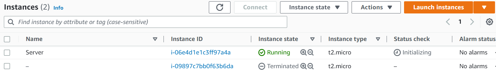

Ví dụ ta dùng Terraform để tạo hạ tầng trên AWS, sau khi Terraform tạo hạ tầng xong thì nó sẽ tạo ra một state file để lưu lại trạng thái của hạ tầng. Nếu có ai đó không dùng Terraform mà truy cập thẳng lên AWS Web Console để thay đổi bất cứ thứ gì liên quan tới hạ tầng của ta, thì lúc này trạng thái của hạ tầng trong state file sẽ khác với hạ tầng thực tế, ta sẽ giải quyết vấn đề này như thế nào trong Terraform?

# Create infrastructure
```
provider "aws" {
  region = "us-east-2"
}

data "aws_ami" "ubuntu" {
  most_recent = true

  filter {
    name   = "name"
    values = ["ubuntu/images/hvm-ssd/ubuntu-focal-20.04-amd64-server-*"]
  }

  owners = ["099720109477"]
}

resource "aws_security_group" "allow_ssh" {
  name   = "allow-ssh"

  ingress {
    from_port = "22"
    to_port   = "22"
    protocol  = "tcp"
    cidr_blocks = [
      "0.0.0.0/0",
    ]
  }

  egress {
    from_port   = 0
    to_port     = 0
    protocol    = "-1"
    cidr_blocks = ["0.0.0.0/0"]
  }

  tags = {
    Name  = "allow-ssh"
  }
}

resource "aws_instance" "server" {
  ami           = data.aws_ami.ubuntu.id
  instance_type = "t2.micro"

  vpc_security_group_ids = [
    aws_security_group.allow_ssh.id
  ]

  lifecycle {
    create_before_destroy = false
  }

  tags = {
    Name  = "Server"
  }
}

output "instance_id" {
  value = aws_instance.server.id
}
```
Chạy câu lệnh để tạo resource.
```
terraform init && terraform apply -auto-approve
```
```
Apply complete! Resources: 2 added, 0 changed, 0 destroyed.

Outputs:

instance_id = "i-01f011bf49adac5fa"
```
Mở aws console sẽ thấy ec2 vừa tạo

# Change Infrastructure
Ví dụ dùng AWS CLI để tạo Security Group và gán nó vào EC2. Tạo SG.
```
aws ec2 create-security-group --group-name "allow-http" --description "allow http" --region us-east-2 --output text

```
SG id được in ra terminal, lưu giá trị này lại để lát nữa sử dụng.
```
sg-0e768a8b30604fecb
```

Cập nhật SG cho phép truy cập port 80
~~~
aws ec2 authorize-security-group-ingress --group-name "allow-http" --protocol tcp --port 80 --cidr 0.0.0.0/0 --region us-east-2
~~~

Gán SG vào EC2.
~~~
current_sg=$(aws ec2 describe-instances --instance-ids $(terraform output -raw instance_id) --query Reservations[*].Instances[*].SecurityGroups[*].GroupId --region us-east-2 --output text)
~~~
~~~
aws ec2 modify-instance-attribute --instance-id $(terraform output -raw instance_id) --groups $current_sg sg-0e768a8b30604fecb --region us-east-2
~~~

Lúc này thì hạ tầng aws đã khác so với terraform state. chạy lệnh plan để thấy được sự khác biệt
```
terraform plan
```


> Nếu bây giờ chạy *terraform apply* thì hạ tầng sẽ rollback lại giống như file state.
> Nếu muốn file state phản ánh đúng thực tế thì có 2 cách làm.
> - terraform refresh
> - terraform apply -refresh-only
## Terraform refresh
Khi chạy lệnh *terraform refresh* thì terraform sẽ đọc trạng thái của hạ tầng nó đang quản lý, sau đó cập nhật lại state cho giống với hạ tầng
> Tiếp theo phải cập nhật lại code bằng tay.

Cập nhật lại main.tf
```
...
resource "aws_instance" "server" {
  ami           = data.aws_ami.ubuntu.id
  instance_type = "t2.micro"

  vpc_security_group_ids = [
    aws_security_group.allow_ssh.id,
    "sg-0e768a8b30604fecb"
  ]

  lifecycle {
    create_before_destroy = false
  }

  tags = {
    Name  = "Server"
  }
}
``` 

## Terraform refresh only
Giống với với câu lệnh refresh thì refresh only cũng sẽ đọc trạng thái của hạ tầng mà nó đang quản lý, nhưng thay vì cập nhật luôn Terraform state thì nó sẽ cho phép ta thấy resource nào sẽ thay đổi và ta có chấp nhận cập nhật lại state file không
```
terraform apply -refresh-only
```

# Terraform import
Để quản lý một resource mà chưa có trong file code của Terraform , 
- Khai báo cấu hình source code
- Dùng lệnh *terraform import* để import resource vào state file

Cập nhật main.tf thêm vào SG của sg-0e768a8b30604fecb
```
...

resource "aws_security_group" "allow_http" {
  name        = "allow-http"
  description = "allow http"

  ingress {
    from_port = "80"
    to_port   = "80"
    protocol  = "tcp"
    cidr_blocks = [
      "0.0.0.0/0",
    ]
  }

  tags = {
    Name = "allow-http"
  }
}

...
```
Chạy lệnh import
```
terraform import aws_security_group.allow_http sg-0e768a8b30604fecb
```


Chạy lệnh *teffarom apply* sẽ có 1 số thay đổi nhỏ


