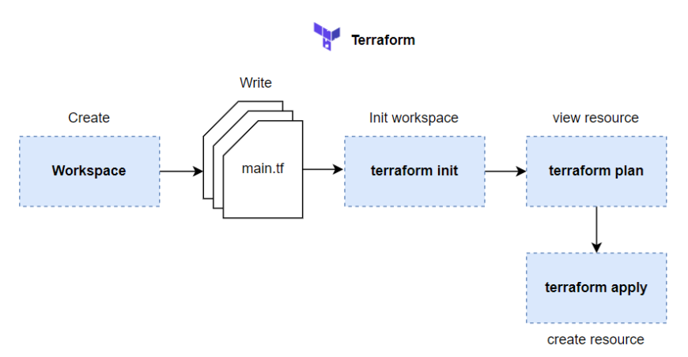
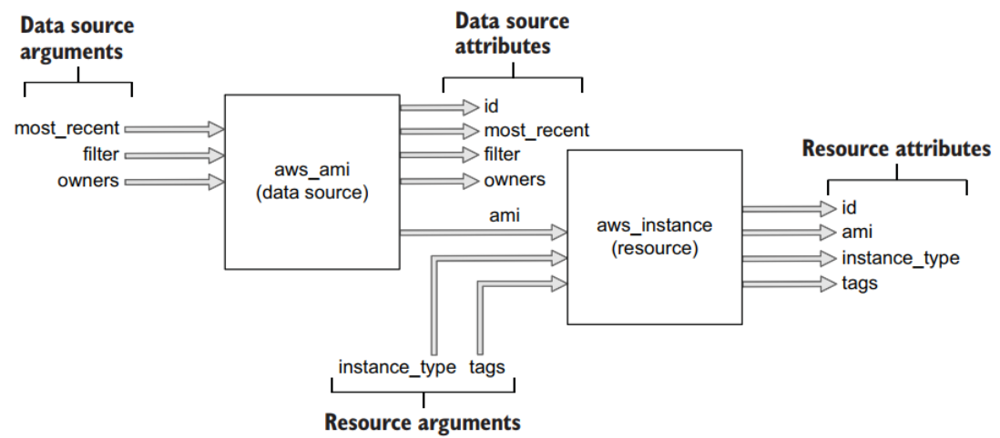
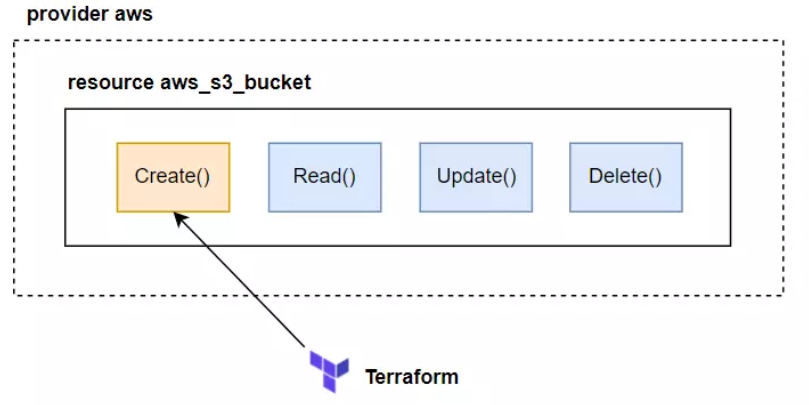
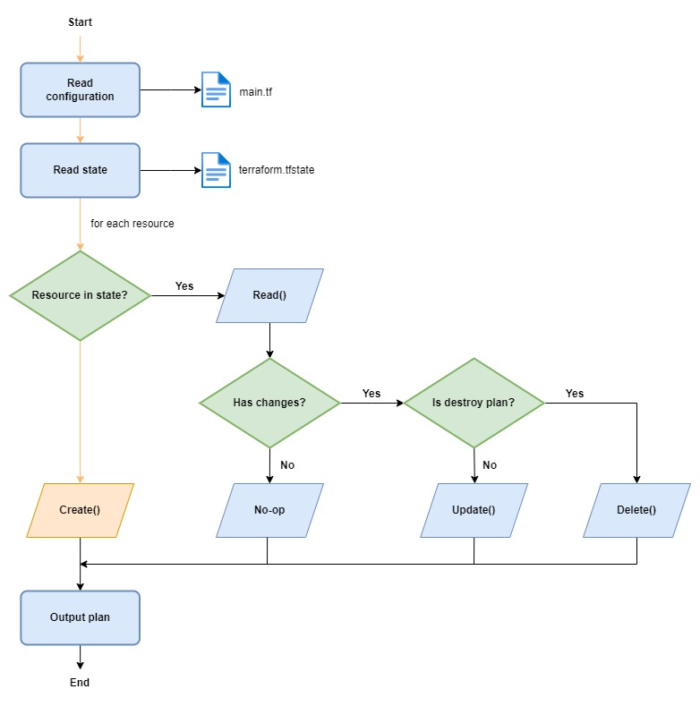
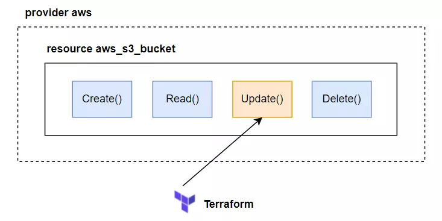
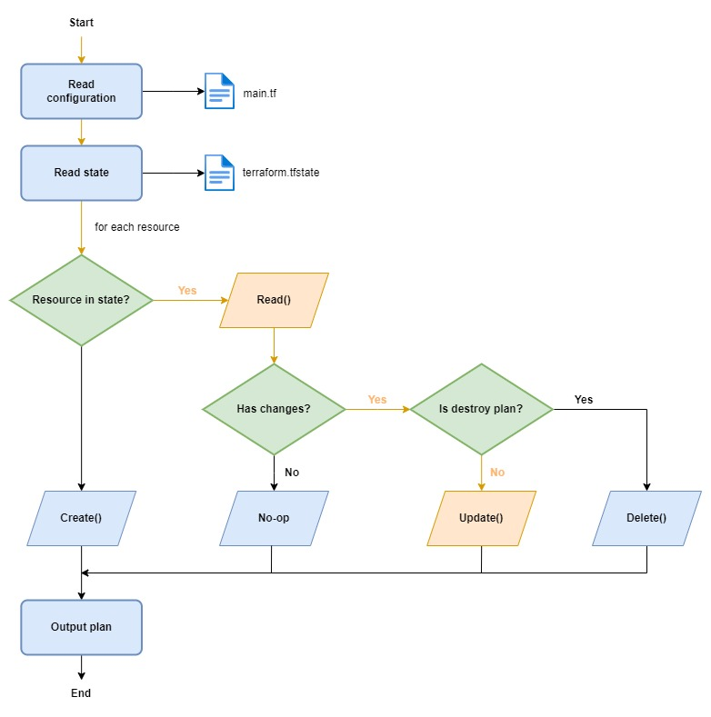
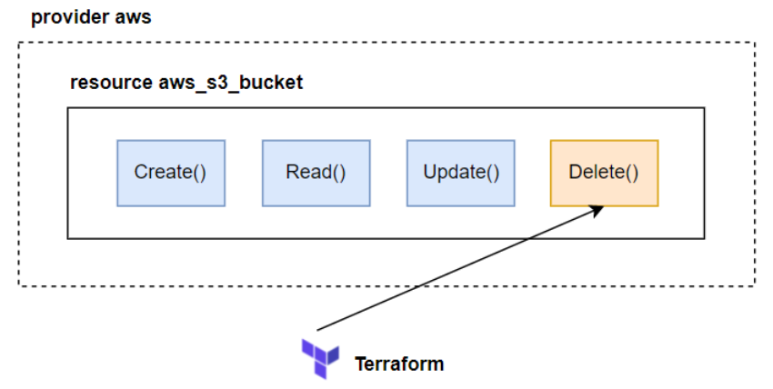
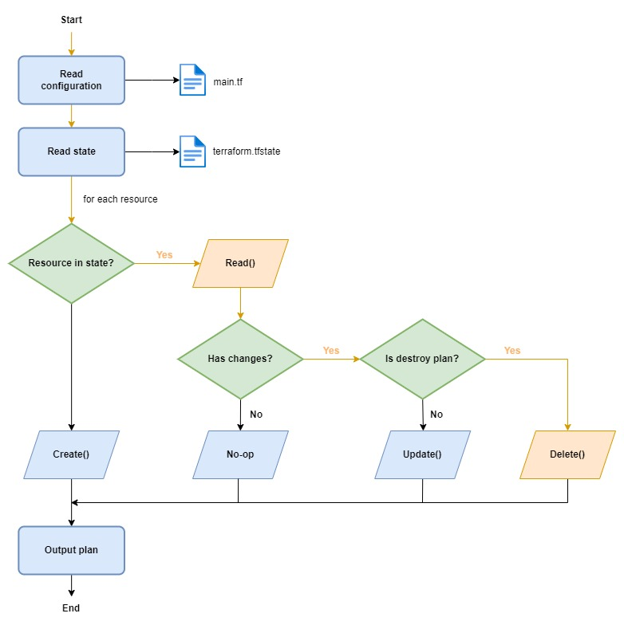

# Life cycle của một resource trong Terraform
## Cách khởi tạo source code để viết config file và vòng đời của 1 resource trong Terraform.
* Để tạo provisioning infrastructure mới 
=> Tạo workspace => viết config file => Khởi tạo workspace với *terraform init* => Kiểm tra resource nào được tạo với *terraform plan* => Tạo resource bằng *terraform apply*


* Provisioning infrastructure
** Tạo workspace và viết config
> Tạo workspace đơn giản(folder), tạo 1 file main.tf
```
provider "aws" {
  region = "us-east-2"
}
resource "aws_instance" "server" {
  ami           = "ami-05bfbece1ed5beb54"
  instance_type = "t2.micro"
  tags = {
    "Name" = "server"
  }
}

```

> Chạy câu lệnh *terraform init* để tải aws provider xuống folder hiện tại để terraform có thể sử dụng provider gọi API lên ASW để tạo resource.

>Sau khi init xong, sẽ có một folder tên là .terraform được tạo ra, đây là folder chứa code của provider. Cấu trúc folder sau.
```
├── .terraform
│   └── providers
│       └── registry.terraform.io
│           └── hashicorp
│               └── aws
│                   └── 4.52.0
│                       └── linux_amd64
│                           └── terraform-provider-aws_v4.52.0_x5
├── .terraform.lock.hcl
└── main.tf
```
* Kiểm tra resources nào được tạo ra 
> terraform plan

~~~
Terraform used the selected providers to generate the following execution plan.
Resource actions are indicated with the following symbols:
  + create

Terraform will perform the following actions:

  # aws_instance.bai1 will be created
  + resource "aws_instance" "bai1" {
      + ami                                  = "ami-05bfbece1ed5beb54"
      + arn                                  = (known after apply)
      + associate_public_ip_address          = (known after apply)
      + availability_zone                    = (known after apply)
      + cpu_core_count                       = (known after apply)
      + cpu_threads_per_core                 = (known after apply)
      + disable_api_stop                     = (known after apply)
      + disable_api_termination              = (known after apply)
      + ebs_optimized                        = (known after apply)
      + get_password_data                    = false
      + host_id                              = (known after apply)
      + host_resource_group_arn              = (known after apply)
      + iam_instance_profile                 = (known after apply)
      + id                                   = (known after apply)
      + instance_initiated_shutdown_behavior = (known after apply)
      + instance_state                       = (known after apply)
      + instance_type                        = "t2.micro"
      + ipv6_address_count                   = (known after apply)
      + ipv6_addresses                       = (known after apply)
      + key_name                             = (known after apply)
      + monitoring                           = (known after apply)
      + outpost_arn                          = (known after apply)
      + password_data                        = (known after apply)
      + placement_group                      = (known after apply)
      + placement_partition_number           = (known after apply)
      + primary_network_interface_id         = (known after apply)
      + private_dns                          = (known after apply)
      + private_ip                           = (known after apply)
      + public_dns                           = (known after apply)
      + public_ip                            = (known after apply)
      + secondary_private_ips                = (known after apply)
      + security_groups                      = (known after apply)
      + source_dest_check                    = true
      + subnet_id                            = (known after apply)
      + tags                                 = {
          + "Name" = "Bai1"
        }
      + tags_all                             = {
          + "Name" = "Bai1"
        }
      + tenancy                              = (known after apply)
      + user_data                            = (known after apply)
      + user_data_base64                     = (known after apply)
      + user_data_replace_on_change          = false
      + vpc_security_group_ids               = (known after apply)

      + capacity_reservation_specification {
          + capacity_reservation_preference = (known after apply)

          + capacity_reservation_target {
              + capacity_reservation_id                 = (known after apply)
              + capacity_reservation_resource_group_arn = (known after apply)
            }
        }

      + ebs_block_device {
          + delete_on_termination = (known after apply)
          + device_name           = (known after apply)
          + encrypted             = (known after apply)
          + iops                  = (known after apply)
          + kms_key_id            = (known after apply)
          + snapshot_id           = (known after apply)
          + tags                  = (known after apply)
          + throughput            = (known after apply)
          + volume_id             = (known after apply)
          + volume_size           = (known after apply)
          + volume_type           = (known after apply)
        }

      + enclave_options {
          + enabled = (known after apply)
        }

      + ephemeral_block_device {
          + device_name  = (known after apply)
          + no_device    = (known after apply)
          + virtual_name = (known after apply)
        }

      + maintenance_options {
          + auto_recovery = (known after apply)
        }

      + metadata_options {
          + http_endpoint               = (known after apply)
          + http_put_response_hop_limit = (known after apply)
          + http_tokens                 = (known after apply)
          + instance_metadata_tags      = (known after apply)
        }

      + network_interface {
          + delete_on_termination = (known after apply)
          + device_index          = (known after apply)
          + network_card_index    = (known after apply)
          + network_interface_id  = (known after apply)
        }

      + private_dns_name_options {
          + enable_resource_name_dns_a_record    = (known after apply)
          + enable_resource_name_dns_aaaa_record = (known after apply)
          + hostname_type                        = (known after apply)
        }

      + root_block_device {
          + delete_on_termination = (known after apply)
          + device_name           = (known after apply)
          + encrypted             = (known after apply)
          + iops                  = (known after apply)
          + kms_key_id            = (known after apply)
          + tags                  = (known after apply)
          + throughput            = (known after apply)
          + volume_id             = (known after apply)
          + volume_size           = (known after apply)
          + volume_type           = (known after apply)
        }
    }

Plan: 1 to add, 0 to change, 0 to destroy.

───────────────────────────────────────────────────────────────────────────────

Note: You didn't use the -out option to save this plan, so Terraform can't
guarantee to take exactly these actions if you run "terraform apply" now.

~~~

> Khi chạy câu lệnh plan trên thì nó sẽ hiển thị ra những resouce nào sẽ được tạo, ở dòng hiển thị gần cuối là Plan: 1 to add, 0 to change, 0 to destroy., nghĩa là sẽ có 1 resource được thêm vào infrastructure hiện tại.
> Ngoài việc hiển thị những resource sẽ được tạo, câu lệnh này cũng sẽ kiểm tra lỗi syntax của file terraform config và sẽ báo lỗi nếu không viết đúng syntax.

> Khi có quá nhiều resource và câu lệnh plan bị chậm, có thể tăng tốc nó lên bằng việc thêm vào -parallelism=n. Ví dụ như sau: terraform plan -parallelism=2

Nếu cần lưu lại kết quả của câu lệnh plan, thì sử dụng thêm -out option khi chạy. Ví dụ ta sẽ save lại kết quả của câu lệnh plan trong file json.
```
$terraform plan -out plan.out
$ terraform show -json plan.out > plan.json
```
### Tạo resource
*terraform apply*

* Khi ta chạy câu lệnh apply, thì terraform sẽ chạy câu lệnh plan trước, để review resource, và nó sẽ hiện chỗ để hỏi ta là có muốn tạo những resource này không, chỉ khi đồng ý nhập đúng giá trị này thì resource của mới được tạo ra.

* Lệnh apply cũng chạy plan thì chạy lệnh *terraform plan* trước để làm gì?
> Thì thật ra những câu lệnh trên được thiết kế cho quá trình CI/CD. Có thể chạy câu lệnh plan trước, với -out option, để review resource, sau đó sẽ chạy câu lệnh apply với kết quả của plan trước đó, như sau:

Đầu tiên là sẽ chạy job để kiểm tra resource.

```
terraform plan -out plan.out
```
Nếu mọi thứ ok thì job trên sẽ pass và tiếp theo sẽ chạy job để tạo resource.
```
terraform apply "plan.out"
```
Ok, quay lại câu lệnh apply ở trên, chọn yes để nó tạo EC2 trên AWS.

```
...
Plan: 1 to add, 0 to change, 0 to destroy.

Do you want to perform these actions?
  Terraform will perform the actions described above.
  Only 'yes' will be accepted to approve.

  Enter a value: yes

aws_instance.hello: Creating...
aws_instance.hello: Still creating... [10s elapsed]
aws_instance.hello: Still creating... [20s elapsed]
aws_instance.hello: Still creating... [30s elapsed]
aws_instance.hello: Still creating... [40s elapsed]
aws_instance.hello: Creation complete after 42s [id=i-0c0285db1ffe968a2]

Apply complete! Resources: 1 added, 0 changed, 0 destroyed.
```
Khi chạy xong sẽ thấy có một file mới được tạo ra là terraform.tfstate.

Đây là file terraform dùng để lưu lại state của tất cả resource, để nó quản lý và track tất cả các resource trên hạ tầng. Nó lưu những giá trị của EC2.
```
{
  "version": 4,
  "terraform_version": "1.0.0",
  "serial": 1,
  "lineage": "fa28c290-92d6-987f-c49d-bc546b296abd",
  "outputs": {},
  "resources": [
    {
      "mode": "managed",
      "type": "aws_instance",
      "name": "hello",
      "provider": "provider[\"registry.terraform.io/hashicorp/aws\"]",
      "instances": [
        {
          "schema_version": 1,
          "attributes": {
            "ami": "ami-05bfbece1ed5beb54",
            ...
}
```

Để xóa resource thì chạy lệnh *terraform destroy*, khi chạy thì nó cũng sẽ chạy câu lệnh plan trước để liệt kê ra những resource mà nó sẽ xóa, và hỏi  có muốn xóa hay không. Sau khi terraform nó chạy xong, mở file terraform.tfstate lên thì bây giờ trường resources trong file này sẽ là rỗng.

```
{
  "version": 4,
  "terraform_version": "1.0.0",
  "serial": 3,
  "lineage": "fa28c290-92d6-987f-c49d-bc546b296abd",
  "outputs": {},
  "resources": []
}
```

### Ở trên là các bước cần thực hiện để tạo một infrastructure mới. Và bên cạnh việc sử dụng resource block để tạo resource, thì terraform có cung cấp cho một block khác dùng để queries và tìm kiếm data trên AWS, block này sẽ giúp tạo resource một cách linh hoạt hơn là phải điền giá trị cố định của resource. Ví dụ như ở trên thì trường ami của EC2 fix giá trị là ami-05bfbece1ed5beb54, để biết được giá trị này thì phải lên AWS để kiếm, với lại nếu dùng giá trị này thì người khác đọc cũng không biết được giá trị này là thuộc ami loại gì
## Data block

> Terraform cung cấp một block tên là data, được dùng để gọi API lên infrastructure thông qua provider và lấy thông tin về một resource nào đó, block này nó sẽ không thực hiện hành động tạo resource trên infrastructure. Ví dụ: file main.tf trên như sau:
```
provider "aws" {
  region = "us-west-2"
}

data "aws_ami" "ubuntu" {
  most_recent = true

  filter {
    name   = "name"
    values = ["ubuntu/images/hvm-ssd/ubuntu-focal-20.04-amd64-server-*"]
  }

  owners = ["746186632829"] # Canonical Ubuntu AWS account id
}

resource "aws_instance" "hello" {
  ami           = data.aws_ami.ubuntu.id # Change here, reference to result of data block instead of fix value
  instance_type = "t2.micro"
  tags = {
    Name = "HelloWorld"
  }
}
```

Ở file trên, dùng data block để gọi API tới AWS Cloud và lấy thông tin về ami (Amazon Machine Images), sau đó ở dưới resource block thay đổi lại trường ami bằng giá trị id lấy được từ data block ở trên ra. Syntax của data block.


Khi chạy câu lệnh plan, sẽ thấy ở dòng Plan gần cuối nó vẫn chỉ hiển thị chỉ 1 resource sẽ được thêm, do data block không tạo ra resource, bên cạnh đó thì ở trường ami nó sẽ in ra giá trị lấy được từ data block.

```
$ terraform plan
Terraform used the selected providers to generate the following execution plan. Resource actions are indicated with the
following symbols:
  + create

Terraform will perform the following actions:

  # aws_instance.hello will be created
  + resource "aws_instance" "hello" {
      + ami                                  = "ami-05bfbece1ed5beb54"
      ...
    }

Plan: 1 to add, 0 to change, 0 to destroy.

───────────────────────────────────────────────────────────────────────────────────────────────────────────────────────────

Note: You didn't use the -out option to save this plan, so Terraform can't guarantee to take exactly these actions if you
run "terraform apply" now.
```



# Life cycle

> Sau khi làm qua ví dụ ở trên, Terraform là một công cụ để quản lý state thông qua file terraform.tfstate và thực hiện hành động CRUD lên các resource của một infrastructure nào đó, thông thường thì những resource của ta sẽ là cloud-based resources, nhưng terraform không giới hạn ở cloud mà là tất cả những resource nào mà có thể thực hiện CRUD lên nó, đều có thể quản lý thông qua terraform. Ở phần này thì sẽ dùng terraform để tạo một S3 (AWS Simple Cloud Storage) trên AWS để tìm hiểu về vòng đời của một resource


## Life cycle function hooks
Tất cả các resource type của terraform đều implement một CRUD interface, trong CRUD interface này sẽ có các function hooks là Create(), Read(), Update(), Delete() và function này sẽ được thực thi nếu gặp đúng điều kiện phù hợp.

Còn data type thì nó implement một Read interface chỉ có một function hooks là Read().


Create() sẽ được gọi trong quá trình tạo resource, Read() được gọi trong quá trình plan, Update() được gọi trong quá trình cập nhật resource, và Delete() được gọi trong quá trình xóa resource.

## Ví dụ về S3 resource

```
provider "aws" {
  region = "us-east-2"
}

resource "aws_s3_bucket" "terraform-bucket" {
  bucket = "terraform-bucket-2023-01-02"

  tags = {
    Name = "Terraform Series"
  }
}

```
### Plan

Bên cạnh việc hiển thị những resource nào sẽ được tạo ra, thì nếu đã có resource rồi mà thay đổi giá trị gì trong file terraform, thì plan sẽ hiển thị cho là resource nào sẽ được cập nhật lại dựa theo state của resource trước đó đã được tạo ra.

Và nếu ta không thay đổi gì trong file terraform, thì khi chạy plan thì nó sẽ hiển thị là không có resource nào được thêm vào hoặc được cập nhật.

Quá trình plan sẽ in ra cho những kết quả rất hữu ích, chỉ cần đọc những gì quá trình plan in là biết resource trên infrastructure sẽ như thế nào. Khi chạy câu lệnh plan, thì terraform sẽ thực hiện 3 bước chính như sau:

* Đọc file configuration và state files: terraform sẽ đọc file configuration và state files (nếu có tồn tại) trước để lấy thông tin về resource đang ra sao.
* Sau đó nó sẽ xác định những hành động nào sẽ được thực hiện: terraform sẽ thực hiện tính toán để xác định hành động nào sẽ được thực thi, có thể là Create(), Read(), Update(), Delete(), hoặc không làm gì cả (No-op).
* Output plan

> Biểu đồ minh họa của quá trình Plan


### Create S3 resource

Chạy lệnh apply để tạo S3 trên AWS, ở trên thì khi chạy lệnh apply nó sẽ có thêm bước xác nhận và bắt ta nhập vào yes, nếu muốn bỏ qua bước xác nhận thì khi chạy ta thêm vào -auto-approve.


Như đã nói ở trên khi chạy xong câu lệnh apply, thì terraform sẽ tạo ra một file terraform.tfstate để lưu state lại, click vào thì sẽ thấy nó lưu state của S3. Mở console web của AWS Cloud sẽ thấy S3 bucket đã được tạo ra với tên như trong file config là "terraform-bucket-2023-01-02".


Làm sao terraform tạo được S3 resource này? Thì trong quá trình apply, terraform sẽ gọi Create() function của aws_s3_bucket resource type.


Thì trong Create() function của resource type aws_s3_bucket có chứa code mà nó sẽ gọi API lên AWS để thực hiện tạo S3 bucket, nên khi terraform gọi tới function này thì S3 resource sẽ được tạo ra.

Biểu đồ luồng create.



### No-op

Khi đã tạo resource xong, nếu không sửa gì cả, thì khi thực thi plan terraform sẽ đi qua bước No-op trong biểu đồ phía trên. Như để đây nếu chạy terraform plan thì đầu tiên terraform sẽ đọc file config, sau đó nó phát hiện có state file, nó đọc state file. Kiểm tra S3 mà viết trong file config có tồn tại trong state file hay không, nếu có terraform sẽ thực thi Read() function của resource type aws_s3_bucket.


Read() sẽ chứa code mà gọi lên AWS để lấy state của S3 hiện tại trên AWS, và so sánh với state của S3 trong state file. Nếu không có gì thay đổi, thì Read() sẽ return về kết quả là không có gì thay đổi. Và terraform sẽ không thực thi hành động nào cả.

Biểu đồ luồng no-op.


### Update S3 resource
Sửa config trong terraform file, trong terraform không có câu lệnh update, chỉ cần sửa config file và chạy lại câu lệnh apply, terrform sẽ tự xác định dựa vào resource state để thực hện update cho ta. Sửa lại bucket name của s3.

```
provider "aws" {
  region = "us-east-2"
}

resource "aws_s3_bucket" "terraform-bucket" {
  bucket = "terraform-bucket-2023-01-02-update"

  tags = {
    Name = "Terraform Series"
  }
}
```


```
mac@mac:~/data/terraform/bai2/S3$ terraform plan
aws_s3_bucket.terraform-bucket: Refreshing state... [id=terraform-bucket-2023-01-02]

Terraform used the selected providers to generate the following execution plan. Resource actions are indicated with the following symbols:
-/+ destroy and then create replacement

Terraform will perform the following actions:

/# aws_s3_bucket.terraform-bucket must be replaced

-/+ resource "aws_s3_bucket" "terraform-bucket" {
      + acceleration_status         = (known after apply)
      + acl                         = (known after apply)
      ~ arn                         = "arn:aws:s3:::terraform-bucket-2023-01-02" -> (known after apply)
      ~ bucket                      = "terraform-bucket-2023-01-02" -> "terraform-bucket-2023-01-02-update" # forces replacement
      ~ bucket_domain_name          = "terraform-bucket-2023-01-02.s3.amazonaws.com" -> (known after apply)
      ~ bucket_regional_domain_name = "terraform-bucket-2023-01-02.s3.us-east-2.amazonaws.com" -> (known after apply)
      ~ hosted_zone_id              = "Z2O1EMRO9K5GLX" -> (known after apply)
      ~ id                          = "terraform-bucket-2023-01-02" -> (known after apply)
      ~ object_lock_enabled         = false -> (known after apply)
      + policy                      = (known after apply)
      ~ region                      = "us-east-2" -> (known after apply)
      ~ request_payer               = "BucketOwner" -> (known after apply)
        tags                        = {
            "Name" = "Terraform Series"
        }
      + website_domain              = (known after apply)
      + website_endpoint            = (known after apply)
        # (2 unchanged attributes hidden)

      + cors_rule {
          + allowed_headers = (known after apply)
          + allowed_methods = (known after apply)
          + allowed_origins = (known after apply)
          + expose_headers  = (known after apply)
          + max_age_seconds = (known after apply)
        }

      - grant {
          - id          = "2eb4f59db9d2795cbdf6fb5c860cd94732a3fe376d6d96c2c5d5bd766c597645" -> null
          - permissions = [
              - "FULL_CONTROL",
            ] -> null
          - type        = "CanonicalUser" -> null
        }
      + grant {
          + id          = (known after apply)
          + permissions = (known after apply)
          + type        = (known after apply)
          + uri         = (known after apply)
        }

      + lifecycle_rule {
          + abort_incomplete_multipart_upload_days = (known after apply)
          + enabled                                = (known after apply)
          + id                                     = (known after apply)
          + prefix                                 = (known after apply)
          + tags                                   = (known after apply)

          + expiration {
              + date                         = (known after apply)
              + days                         = (known after apply)
              + expired_object_delete_marker = (known after apply)
            }

          + noncurrent_version_expiration {
              + days = (known after apply)
            }

          + noncurrent_version_transition {
              + days          = (known after apply)
              + storage_class = (known after apply)
            }

          + transition {
              + date          = (known after apply)
              + days          = (known after apply)
              + storage_class = (known after apply)
            }
        }

      + logging {
          + target_bucket = (known after apply)
          + target_prefix = (known after apply)
        }

      + object_lock_configuration {
          + object_lock_enabled = (known after apply)

          + rule {
              + default_retention {
                  + days  = (known after apply)
                  + mode  = (known after apply)
                  + years = (known after apply)
                }
            }
        }

      + replication_configuration {
          + role = (known after apply)

          + rules {
              + delete_marker_replication_status = (known after apply)
              + id                               = (known after apply)
              + prefix                           = (known after apply)
              + priority                         = (known after apply)
              + status                           = (known after apply)

              + destination {
                  + account_id         = (known after apply)
                  + bucket             = (known after apply)
                  + replica_kms_key_id = (known after apply)
                  + storage_class      = (known after apply)

                  + access_control_translation {
                      + owner = (known after apply)
                    }

                  + metrics {
                      + minutes = (known after apply)
                      + status  = (known after apply)
                    }

                  + replication_time {
                      + minutes = (known after apply)
                      + status  = (known after apply)
                    }
                }

              + filter {
                  + prefix = (known after apply)
                  + tags   = (known after apply)
                }

              + source_selection_criteria {
                  + sse_kms_encrypted_objects {
                      + enabled = (known after apply)
                    }
                }
            }
        }

      + server_side_encryption_configuration {
          + rule {
              + bucket_key_enabled = (known after apply)

              + apply_server_side_encryption_by_default {
                  + kms_master_key_id = (known after apply)
                  + sse_algorithm     = (known after apply)
                }
            }
        }

      ~ versioning {
          ~ enabled    = false -> (known after apply)
          ~ mfa_delete = false -> (known after apply)
        }

      + website {
          + error_document           = (known after apply)
          + index_document           = (known after apply)
          + redirect_all_requests_to = (known after apply)
          + routing_rules            = (known after apply)
        }
    }

Plan: 1 to add, 0 to change, 1 to destroy.

────────────────────────────────────────────────────────────────────────────────────────────────────────────────────────────────────────────────────────────────────────────────

Note: You didn't use the -out option to save this plan, so Terraform can't guarantee to take exactly these actions if you run "terraform apply" now.
```

S3 bucket sẽ được terraform update lại bằng cách thực hiện destroy and then create replacement. Nghĩa là trước tiên terraform sẽ xóa S3 resource cũ, sau đó nó sẽ tạo lại resource S3 mới với tên bucket khác. Tại sao lại như vậy thì trường bucket ở trong resource type aws_s3_bucket là một thuộc tính force new.

Trong terraform, resource sẽ có hai loại thuộc tính (attribute) là force new với normal update:

* Force new attribute: resource sẽ được re-create (xóa resource cũ trước và tạo ra lại resouce mới).


* Normal update attribute: resource được update bình thường, không cần phải xóa resouce cũ.



Một thuộc tính sẽ thuộc loại nào thì tùy thuộc vào provider và resource type. Ở trên vì thay đổi thuộc tính force new của aws_s3_bucket nên nó sẽ được re-create. Vì việc xóa và tạo lại sẽ gặp rất nhiều vấn đề, nên cần chạy câu lệnh plan để xác định tại sao resource lại như vậy, đây là tác dụng của việc chạy câu lệnh plan trước, nhớ là luôn luôn nên chạy plan trước khi deploy.

Vì S3 bucket của mới tạo và không có gì trong đó hết, nên cứ chạy terraform apply để nó update bình thường.


Sau khi chạy xong thì kiểm tra trên Aws console thì S3 bucket đã được tạo ra.

Biểu đồ của luồng update


### Delete S3 resource

Khi chạy lệnh destroy, thì trước đó nó sẽ thực hiện plan, đọc trong state file xem coi có resource đó không, nếu có thì nó sẽ thực hiện Delete() function của resource type aws_s3_bucket.



Biểu đồ luồng delete


Sau khi ta chạy câu lệnh destroy xong, thì workspace của ta sẽ như sau:

```
.
├── main.tf
├── terraform.tfstate
└── terraform.tfstate.backup
```

Có thêm file terraform.tfstate.backup, là file được tạo ra từ state file trước đó, để xem state trước đó của các resource tạo ra sao.

> Khi xóa toàn bộ config trong file terraform và chạy câu lệnh apply thì tương ứng như chạy câu lệnh terraform destroy.


### Resource drift
 Nếu mà có ai đó thay đổi config của resource chúng ta bên ngoài terraform thì sao? Terraform sẽ xử lý việc đó như thế nào?

- Dùng lại resource s3 ở trên tạo lại
```
terraform apply -auto-approve
```
Sau đó truy cập AWS console và sửa lại trường tag của S3

Lúc này terraform không có tự động phát hiện và update lại file config terraform. Mà khi chạy câu lệnh apply, nó sẽ phát hiện thay đổi và update lại trường tags mà thay đổi ngoài terraform thành giống với tags viết trong file config. Chạy câu lệnh plan trước để xem.


> Terraform sẽ phát hiện được resource đã bị thay đổi bên ngoài terraform, nó in ra câu Note: Objects have changed outside of Terraform để báo biết việc đó. Và tùy thuộc vào thuộc tính mà ta thay đổi bên ngoài terraform là force new hay normal update thì terraform sẽ thực hiện re-create hay update bình thường.

> Giờ Chạy lại câu lệnh apply thì S3 tags củađược update lại như cũ.


# [=> Terraform function programming](https://github.com/luudinhmac/terraform/tree/master/3.tf_function_programing)
