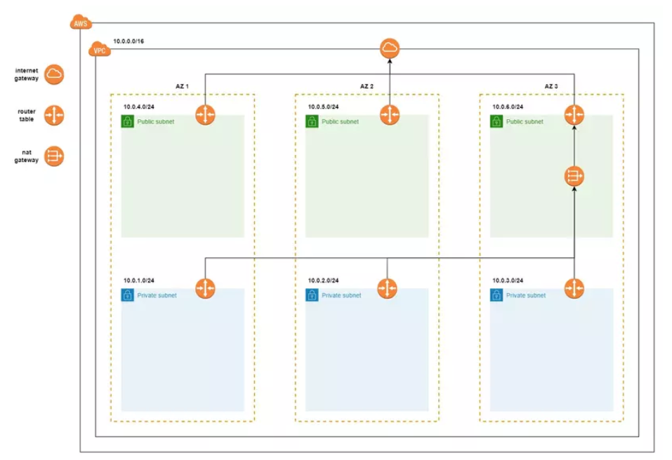

# Provisioning Virtual Private Cloud

## VPC
VPC hiểu đơn giản là một mạng ảo nội bộ, nó là một container mà chứa toàn bộ các service của ta bên trong network của nó
Mặc định thì mỗi region của AWS sẽ có một VPC mặc định tên là default. Để tạo một thằng mới, ta dùng resource aws_vpc của Terraform
Ở trên ta sẽ tạo một VPC mới với cidr là 10.0.0.0/16 và tên là Custom. CIDR của VPC sẽ có các giá trị nằm trong khoảng sau:

10.0.0.0/16 -> 10.0.0.0/28
172.16.0.0/16 -> 172.16.0.0/28
192.168.0.0/16 -> 192.168.0.0/28
## Subnet
Subnet sẽ chia VPC của ta ra thành nhiều sub network nhỏ hơn. Mỗi subnet sẽ nằm trong một AZ. Và các service của ta sẽ được launch ở trong subnet này.


Dùng aws_subnet của Terraform để tạo subnet.
~~~
main.tf

resource "aws_subnet" "private_subnet_2a" {
  vpc_id     = aws_vpc.vpc.id
  cidr_block = "10.0.1.0/24"
  availability_zone = "us-east-2a"

  tags = {
    "Name" = "private-subnet"
  }
}
~~~

```
locals {
  private = ["10.0.1.0/24", "10.0.2.0/24", "10.0.3.0/24"]
  zone   = ["us-east-2a", "us-east-2b", "us-east-2c"]
}

resource "aws_subnet" "private_subnet" {
  count = length(local.private)

  vpc_id            = aws_vpc.vpc.id
  cidr_block        = local.private[count.index]
  availability_zone = local.zone[count.index % length(local.zone)]

  tags = {
    "Name" = "private-subnet"
  }
}
```

## Internet gateway
Để các service bên trong subnet có thể tương tác được với bên ngoài, thì cần phải có internet gateway (IG), và gán IG này vào route table. Sau đó gán subnet nào mà muốn nó có thể tương tác được với internet bên ngoài vào route table này


Tạo IG
```
...
resource "aws_internet_gateway" "ig" {
  vpc_id = aws_vpc.vpc.id

  tags = {
    "Name" = "custom"
  }
}
```
Gán Ig vào Route table
```
...
resource "aws_internet_gateway" "ig" {
  vpc_id = aws_vpc.vpc.id

  tags = {
    "Name" = "custom"
  }
}

resource "aws_route_table" "public" {
  vpc_id = aws_vpc.vpc.id

  route {
    cidr_block = "0.0.0.0/0"
    gateway_id = aws_internet_gateway.ig.id
  }

  tags = {
    "Name" = "public"
  }
}

```
Gán route table cho các subnet
```
...
resource "aws_route_table_association" "public_association" {
  for_each       = { for k, v in aws_subnet.public_subnet : k => v }
  subnet_id      = each.value.id
  route_table_id = aws_route_table.public.id
}

```

Vậy là các service trong public subnet có thể tương tác được với bên ngoài.
## NAT Gateway
Các private subnet không thể tương tác với bên ngoài, nhưng không gán IG vào nó được, trong khi ta chỉ muốn 1 chiều tương tác từ trong private subnet ra ngoài nhưng không muốn có chiều ngược lại. Và Nat gateway sẽ giúp làm việc này.


Dùng resource aws_nat_gateway của Terraform để tạo NAT.
```
...
resource "aws_eip" "nat" {
  vpc = true
}

resource "aws_nat_gateway" "public" {
  depends_on = [aws_internet_gateway.ig]

  allocation_id = aws_eip.nat.id
  subnet_id     = aws_subnet.public_subnet[0].id

  tags = {
    Name = "Public NAT"
  }
}

```

Tạo private route table và gán NAT vào nó
```
...
resource "aws_route_table" "private" {
  vpc_id = aws_vpc.vpc.id

  route {
    cidr_block = "0.0.0.0/0"
    gateway_id = aws_nat_gateway.public.id
  }

  tags = {
    "Name" = "private"
  }
}

```

Gán route table vào các private subnet.

```
...
resource "aws_route_table_association" "public_private" {
  for_each       = { for k, v in aws_subnet.private_subnet : k => v }
  subnet_id      = each.value.id
  route_table_id = aws_route_table.private.id
}
```

# Terraform Module
Terraform Module là một self-contained packages of code, cho phép gom code lại một chỗ và sử dụng ở nhiều chỗ khác nhau. Khi nói về module, ta có thể nghĩ nó như là một blocks nhỏ trong một sản phẩm lớn, ta sẽ gộp nhiều blocks nhỏ này lại với nhau để ra được sản phẩm cuối cùng, và blocks này có thể lấy để xây dựng sản phẩm khác cũng được.
## Standard Module structure
Một module cơ bản sẽ gồm 3 file sau đây:

main.tf chứa code.
variables.tf chứa input vào của module.
outputs.tf chưa giá trị đầu ra của module.
Ngoài ra còn một vài file khác mà không bắt buộc là providers.tf, versions.tf các bạn xem full cấu trúc ở trang này

Full cấu trúc [](https://www.terraform.io/language/modules/develop#standard-module-structure)
## Using module
Để sử dụng module, sử dụng cấu trúc sau:
```
module <module_name> {
  source = <source>
  version = <version>

  input_one = <input_one>
  input_two = <input_two>
}
```

\<source> có thể là dường dẫn local hoặc một url trên mạng, \<version> chỉ định version của module, \<input_one> là các giá trị input ta định nghĩa trong file variables.tf.
## Write modue
Ví dụ ở trên, thì các giá trị động mà ta cần truyền vào module vpc của ta là:

- vpc cidr_block
- subnet cidr_block và zone.
Tạo folder với cấu trúc như sau.
```
.
├── main.tf
└── vpc
    ├── main.tf
    ├── outputs.tf
    └── variables.tf
```

Định nghĩa giá trị input của module ở trong file [variable.tf](https://github.com/luudinhmac/terraform/blob/master/5.TfModule_Create_VPC_AWS/module/vpc/variables.tf)


Cập nhật lại giá trị của [main.tf](https://github.com/luudinhmac/terraform/blob/master/5.TfModule_Create_VPC_AWS/module/vpc/main.tf) ở trong VPC

Giá trị fix cứng đã thay đổi thành variable, khi dùng module vpc này chỉ cần truyền vào giá trị input khác thì sẽ có được vpc khác.
> Cập nhật lại file [main.tf](https://github.com/luudinhmac/terraform/blob/master/5.TfModule_Create_VPC_AWS/module/main.tf) ở ngoài cùng

Bây giờ chạy *terraform plan* nếu nó in ra giá trị như dưới đây thì module đã chạy đúng.
```
...
Plan: 18 to add, 0 to change, 0 to destroy.
...
```
## Public module
Tiếp theo ta sẽ đẩy module của ta lên trên mạng để mọi người có thể sử dụng, để tạo module thì ta cần phải có tài khoản github và truy cập trang \<https://registry.terraform.io> login vào nó.

Đăng nhập github và tạo một repo ở trạng thái public, tên phải ở dạng format terraform-\<PROVIDER>-\<NAME>, sau đó copy 3 file ở folder vpc và đẩy lên github repo đó, ví dụ của mình tạo một repo tên là terraform-aws-vpc.


> Sau đó tạo tag version 


> Sau đó truy cập trang registry ở trên. Đăng nhập và chọn Publish > module


Sau khi chọn module thì tới trang tiếp theo ta chọn project đã tạo ở trên github


Sau khi chọn xong và nhấn Publish 


Phía bên phải có để cách làm sau để sử dụng module này. Giờ nếu ta muốn tạo VPC thì ta sẽ sử dụng module như sau.
```
module "vpc" {
  source  = "luudinhmac/vpc/aws"
  version = "1.0.0"
  
  vpc_cidr_block    = "10.0.0.0/16"
  private_subnet    = ["10.0.1.0/24", "10.0.2.0/24", "10.0.3.0/24"]
  public_subnet     = ["10.0.4.0/24", "10.0.5.0/24", "10.0.6.0/24"]
  availability_zone = ["us-west-2a", "us-west-2b", "us-west-2c"]
}
```

# Common module

Khi làm thực tế cho môi trường production, ta nên xài những module có sẵn trên mạng, họ viết sẽ kĩ hơn nhiều và sẽ có rất nhiều chức năng và use case hơn

