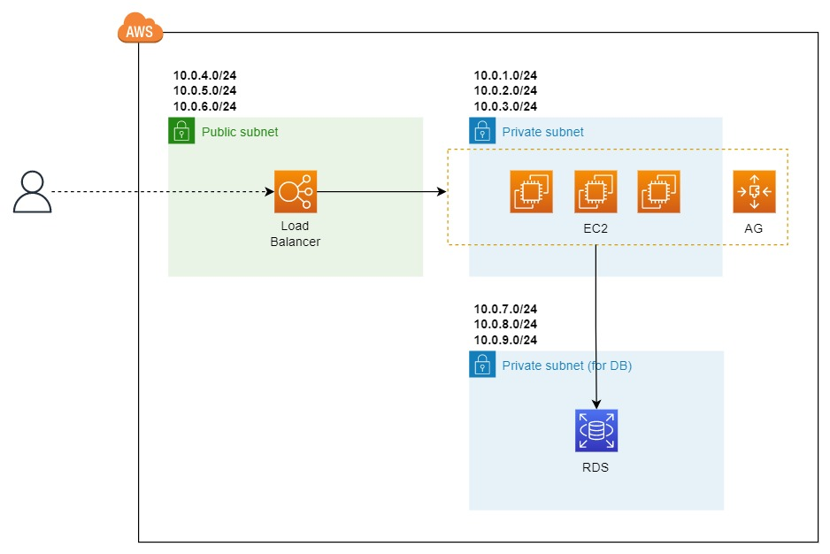
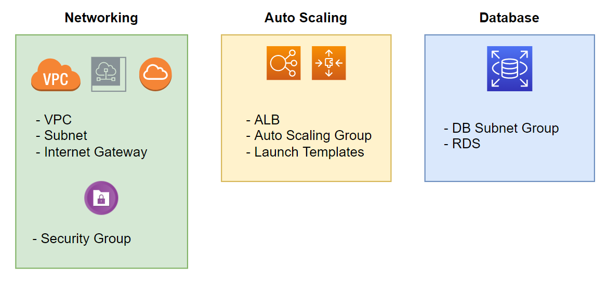
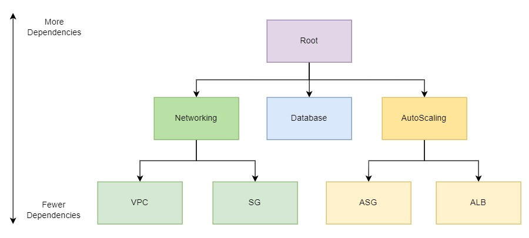
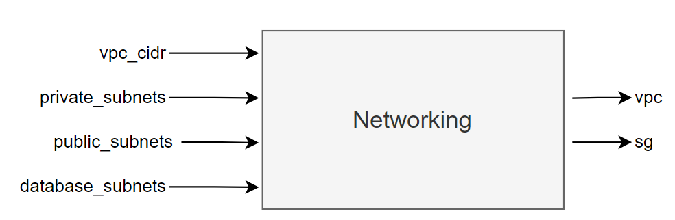
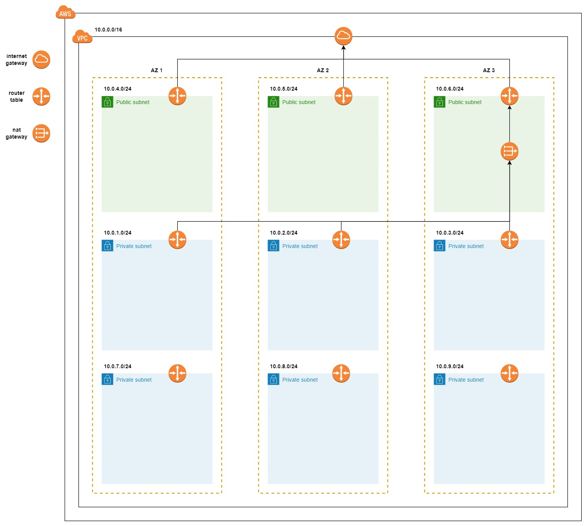
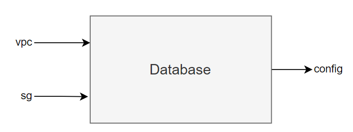
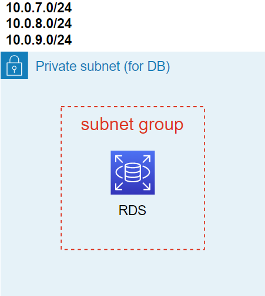
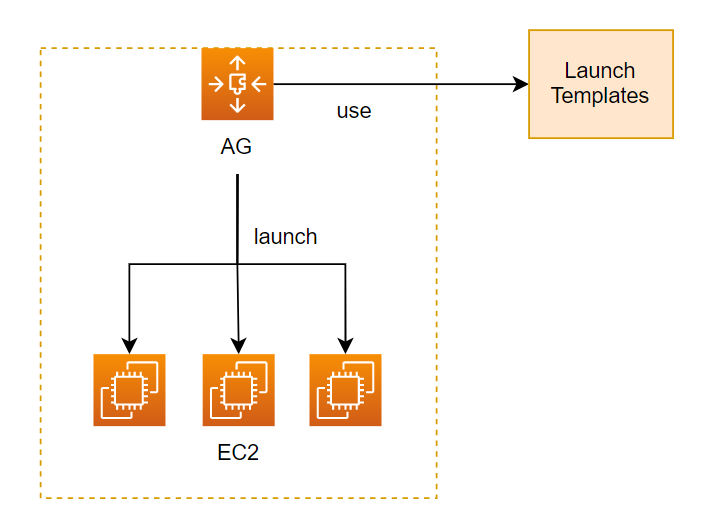

# Introduce 
xây dựng hạ tầng cho một ứng dụng Multi-Tier bao gồm AWS Application Load Balancer + Auto Scaling Group + Relational Database Service.
Với Auto Scaling Group nó sẽ tạo ra một group EC2 mà hosting web server mà chạy ở port 80, và dữ liệu ta sẽ lưu ở RDS loại Postgres, và client sẽ truy cập tới dứng dụng của ta thông qua Load Balancer. Đây là một mô hình rất phổ biến ở trên AWS, minh họa như sau.


Có 3 thành phần chính trong mô hình trên là Networking, AutoScaling và Database. Từng thành phần chính sẽ được group lại thành một module như sau



# Root module

Tất cả các workspace đều có root module. Ở trong root module đó, chúng ta có thể có một hoặc nhiều child modules. Module có thể là local module với source code hoặc remote moudle tải xuống bằng câu lệnh terraform init. Mô hình cây mối quan hệ giữ các module.


Như ta thấy ở module hình trên thì Networking, AutoScaling và RDS là child module của root module. Và trong một module nó có thể có chứa một hoặc nhiều module khác, như Networking nó chứa VPC module và SG (Security Group) module, nếu một module nằm trong một module khác, ta gọi nó là nested modules.

## Write code
Viết code có cấu trúc sau
```
.
├── main.tf
└── modules
    ├── autoscaling
    │   ├── main.tf
    │   ├── outputs.tf
    │   └── variables.tf
    ├── database
    │   ├── main.tf
    │   ├── outputs.tf
    │   └── variables.tf
    └── networking
        ├── main.tf
        ├── outputs.tf
        └── variables.tf
```

Ở file main.tf của root, ta thêm vào đoạn code sau.
```
locals {
  project = "terraform-series"
}

provider "aws" {
  region = "us-east-2"
}

module "networking" {
  source = "./modules/networking"
}

module "database" {
  source = "./modules/database"
}

module "autoscaling" {
  source = "./modules/autoscaling"
}
```

## Networking Module

Khi viết module thì cần định nghĩa giá trị đầu vào và đầu ra của module, có thể định nghĩa từ đầu hoặc khi viết module xong thấy giá trị nào mà dynamic thì thêm vào cũng được không nhất thiết phải định nghĩa từ ban đầu. Networking module của sẽ có giá trị input và output như sau.



Cập nhật file variables.tf của network module
```
variable "project" {
  type    = string
}

variable "vpc_cidr" {
  type    = string
}

variable "private_subnets" {
  type    = list(string)
}

variable "public_subnets" {
  type    = list(string)
}

variable "database_subnets" {
  type    = list(string)
}
```
Tiếp theo cập nhật file main.tf của networking module.
```
module "vpc" {
  source  = "terraform-aws-modules/vpc/aws"
  version = "3.12.0"
  
  name    = "${var.project}-vpc"
  cidr    = var.vpc_cidr
  azs     = data.aws_availability_zones.available.names

  private_subnets  = var.private_subnets
  public_subnets   = var.public_subnets
  database_subnets = var.database_subnets

  create_database_subnet_group = true
  enable_nat_gateway           = true
  single_nat_gateway           = true
}
```
Đây là remote module mà ta sẽ dùng câu lệnh terraform init để tải xuống, module này sẽ tạo VPC cho ta. Với các giá trị trên thì VPC của ta khi được tạo sẽ như thế này.



Tạo Secutiry Group cho VPC, Secutiry Group phải cho phép:

- Cho phép truy cập port 80 của ALB từ mọi nơi.
- Cho phép truy cập port 80 của các EC2 từ ALB.
- Cho phép truy cập port 5432 của RDS từ EC2.
Thêm SG rule vào
```
...
module "alb_sg" {
  source = "terraform-in-action/sg/aws"
  vpc_id = module.vpc.vpc_id
  ingress_rules = [
    {
      port        = 80
      cidr_blocks = ["0.0.0.0/0"]
    }
  ]
}

module "web_sg" {
  source = "terraform-in-action/sg/aws"
  vpc_id = module.vpc.vpc_id
  ingress_rules = [
    {
      port        = 80
      security_groups = [module.lb_sg.security_group.id]
    }
  ]
}

module "db_sg" {
  source = "terraform-in-action/sg/aws"
  vpc_id = module.vpc.vpc_id
  ingress_rules = [
    {
      port            = 5432
      security_groups = [module.web_sg.security_group.id]
    }
  ]
}

```

Để các module bên ngoài có thể truy cập được các giá trị của module này, cần phải output nó ra. Cập nhật file outputs.tf.
```
output "vpc" {
  value = module.vpc
}

output "sg" {
  value = {
    lb = module.lb_sg.security_group.id
    web = module.web_sg.security_group.id
    db = module.db_sg.security_group.id
  }
}
```
## Output value
Để truy cập giá trị của một module, ta dùng systax sau module.\<name>.\<output_value>, ví dụ để truy cập giá trị lb_sg id của networking module.

module.networking.sg.lb

Cập nhật file main.tf ngoài root
```
locals {
  project = "terraform-series"
}

provider "aws" {
  region = "us-east-2"
}

module "networking" {
  source = "./modules/networking"

  project          = local.project
  vpc_cidr         = "10.0.0.0/16"
  private_subnets  = ["10.0.1.0/24", "10.0.2.0/24", "10.0.3.0/24"]
  public_subnets   = ["10.0.4.0/24", "10.0.5.0/24", "10.0.6.0/24"]
  database_subnets = ["10.0.7.0/24", "10.0.8.0/24", "10.0.9.0/24"]
}

module "database" {
  source = "./modules/database"
}

module "autoscaling" {
  source = "./modules/autoscaling"
}
```
# Database Module
Input và output của database module.


Ở trên AWS, khi tạo RDS, cần phải có một subnet groups trước, rồi RDS mới được deploy lên trên subnet group đó.



Để tạo subnet group bằng Terraform thì ta dùng aws_db_subnet_group resource, ví dụ.
```
resource "aws_db_subnet_group" "default" {
  name       = "main"
  subnet_ids = [aws_subnet.frontend.id, aws_subnet.backend.id]

  tags = {
    Name = "My DB subnet group"
  }
}
```

Ở trên khi dùng module VPC, thì nó đã tạo sẵn một subnet groups sẵn, nên cần truyền vpc vào module database. Ta lấy giá trị subnet group ở trong module vpc như sau module.networking.vpc.database_subnet_group. Cập nhật file database/variables.tf trong database module.
```
variable "project" {
  type = string
}

variable "vpc" {
  type = any
}

variable "sg" {
  type = any
}
```
File database/main.tf.
```
resource "aws_db_instance" "database" {
  allocated_storage      = 20
  engine                 = "postgres"
  engine_version         = "12.7"
  instance_class         = "db.t2.micro"
  identifier             = "${var.project}-db-instance"
  name                   = "terraform"
  username               = "admin"
  password               = "admin"
  db_subnet_group_name   = var.vpc.database_subnet_group
  vpc_security_group_ids = [var.sg.db]
  skip_final_snapshot    = true
}
```
Để tạo RDS trên AWS thì ta sẽ dùng aws_db_instance resource, ở trên ta chỉ định engine của RDS mà ta sẽ xài là postgresql version 12.7, với size là 20GB, giá trị subnet group của RDS, ta lấy giá trị truyền vào từ biến vpc (lát ta sẽ truyền biến này vào database module)


Ta sẽ dùng một resource khác trong terraform giúp ta random passoword, sau đó ta sẽ truyền giá trị password này vào database. Cập nhật code lại.

```
resource "random_password" "password" {
  length           = 16
  special          = true
  override_special = "_%@"
}

resource "aws_db_instance" "database" {
  allocated_storage      = 20
  engine                 = "postgres"
  engine_version         = "12.7"
  instance_class         = "db.t2.micro"
  identifier             = "${var.project}-db-instance"
  db_name                = "series"
  username               = "series"
  password               = random_password.password.result
  db_subnet_group_name   = var.vpc.database_subnet_group
  vpc_security_group_ids = [var.sg.db]
  skip_final_snapshot    = true
}

```
#### Lưu ý khi sử dụng resource này thì password của sẽ được lưu ở trong state file, lúc này ai truy cập vào state file cũng có thể thấy được password
> Ta output giá trị RDS ra ngoài để bên ngoài có thể truy cập được. databases/outputs.tf
```
output "config" {
  value = {
    user     = aws_db_instance.database.username
    password = aws_db_instance.database.password
    database = aws_db_instance.database.name
    hostname = aws_db_instance.database.address
    port     = aws_db_instance.database.port
  }
}

```
Cập nhật lại main.tf ở root
```
locals {
  project = "terraform-series"
}

provider "aws" {
  region = "us-east-2"
}

module "networking" {
  source = "./modules/networking"

  project          = local.project
  vpc_cidr         = "10.0.0.0/16"
  private_subnets  = ["10.0.1.0/24", "10.0.2.0/24", "10.0.3.0/24"]
  public_subnets   = ["10.0.4.0/24", "10.0.5.0/24", "10.0.6.0/24"]
  database_subnets = ["10.0.7.0/24", "10.0.8.0/24", "10.0.9.0/24"]
}

module "database" {
  source = "./modules/database"

  project = local.project
  vpc     = module.networking.vpc
  sg      = module.networking.sg
}

module "autoscaling" {
  source = "./modules/autoscaling"
}

```
Có một điểm ta cần nói là ở file khai báo biến của database module, hai giá trị là vpc với sg, ta khai báo type là any.

database/variables.tf
```
...
variable "vpc" {
  type = any
}

variable "sg" {
  type = any
}
```
khi muốn truyền một giá trị mà không biết nó thuộc loại dữ liệu nào, thì khai báo kiểu dữ của nó là any, ở trên vì biến vpc là any nên ta mới có thể truyền nguyên giá trị của module vpc vào database module được.

# Autoscaling Module
Module cuối cùng sẽ viết là autoscaling module. Để tạo một autoscaling group trên AWS và khiến nó hoạt động được, ta cần một số service phải tạo chung với nó như là Load Balancer, Launch Templates, ... Trong khi Load Balancer, ta cũng cần phải tạo cho nó Load Balancer + Target Group + LB Listener.

Định nghĩa input và output của autoscaling module.


Cập nhật autoscaling/variables.tf
```
variable "project" {
  type = string
}

variable "vpc" {
  type = any
}

variable "sg" {
  type = any
}

variable "db_config" {
  type = object(
    {
      user     = string
      password = string
      database = string
      hostname = string
      port     = string
    }
  )
}
```
Khai báo ASG, để tạo được ASG thì ta cần có một Launch Templates đi kèm với nó, ASG sẽ dùng template này để tạo EC2.


Để tạo Launch Templates, ta dùng resource aws_launch_template, cập nhật file main.tf của autoscaling module.
autoscaling/main.tf
```
data "aws_ami" "ami" {
  most_recent = true

  filter {
    name   = "name"
    values = ["amzn2-ami-hvm-2.0.*-x86_64-gp2"]
  }

  owners = ["amazon"]
}

resource "aws_launch_template" "web" {
  name_prefix   = "web-"
  image_id      = data.aws_ami.ami.id
  instance_type = "t2.micro"

  vpc_security_group_ids = [var.sg.web]

  user_data = filebase64("${path.module}/run.sh")
}
```
File autoscaling/run.sh
```
#!/bin/bash
yum update -y
yum install -y httpd.x86_64
systemctl start httpd
systemctl enable http
echo "$(curl http://169.254.169.254/latest/meta-data/local-ipv4)" > /var/www/html/index.html
```

Dùng data source aws_ami để filter lấy ra image id của OS amazon-linux-2, sau đó gán id này vào launch template , mục user_data ta định nghĩa đoạn script sẽ chạy khi EC2 được tạo ra. Tiếp theo gán nó vào autoscaling group.
autoscaling/main.tf
```
...
resource "aws_autoscaling_group" "web" {
  name                = "${var.project}-asg"
  min_size            = 1
  max_size            = 3
  vpc_zone_identifier = var.vpc.private_subnets

  launch_template {
    id      = aws_launch_template.web.id
    version = aws_launch_template.web.latest_version
  }
}
```

Tiếp theo, vì RDS của được tạo ở chế độ private, nên để EC2 có thể truy cập được tới DB, phải gán IAM role vào trong EC2 này, ở trong Terraform có thể config nó thông qua thuộc tính iam_instance_profile của aws_launch_template resource. Cập nhật lại code autoscaling/main.tf
```
data "aws_ami" "ami" {
  most_recent = true

  filter {
    name   = "name"
    values = ["amzn2-ami-hvm-2.0.*-x86_64-gp2"]
  }

  owners = ["amazon"]
}

module "iam_instance_profile" {
  source  = "terraform-in-action/iip/aws"
  actions = ["logs:*", "rds:*"]
}

resource "aws_launch_template" "web" {
  name_prefix   = "web-"
  image_id      = data.aws_ami.ami.id
  instance_type = "t2.micro"

  vpc_security_group_ids = [var.sg.web]

  user_data = filebase64("${path.module}/run.sh")

  iam_instance_profile {
    name = module.iam_instance_profile.name
  }
}

resource "aws_autoscaling_group" "web" {
  name                = "${var.project}-asg"
  min_size            = 1
  max_size            = 3
  vpc_zone_identifier = var.vpc.private_subnets

  launch_template {
    id      = aws_launch_template.web.id
    version = aws_launch_template.web.latest_version
  }
}

```
Dùng module terraform-in-action/iip/aws để tạo role với quyền là full access tới logs và rds, sau đó  gán nó vào aws_launch_template. Vậy là đã khai báo được ASG, resource mà tiếp theo cần khai báo là Load Balancer, để cho phép user truy cập được tới ASG. Dùng terraform-aws-modules/alb/aws, thêm vào thêm main.tf đoạn code của LB.
autoscaling/main.tf
```
...
module "alb" {
  source             = "terraform-aws-modules/alb/aws"
  version            = "~> 6.0"
  name               = var.project
  load_balancer_type = "application"
  vpc_id             = var.vpc.vpc_id
  subnets            = var.vpc.public_subnets
  security_groups    = [var.sg.lb]
  http_tcp_listeners = [
    {
      port               = 80,
      protocol           = "HTTP"
      target_group_index = 0
    }
  ]
  target_groups = [
    {
      name_prefix      = "web",
      backend_protocol = "HTTP",
      backend_port     = 80
      target_type      = "instance"
    }
  ]
}

resource "aws_autoscaling_group" "web" {
  name                = "${var.project}-asg"
  min_size            = 1
  max_size            = 3
  vpc_zone_identifier = var.vpc.private_subnets
  target_group_arns   = module.alb.target_group_arns

  launch_template {
    id      = aws_launch_template.web.id
    version = aws_launch_template.web.latest_version
  }
}
```
Sau khi khai báo LB thì cập nhật lại thuộc tính target_group_arns của aws_autoscaling_group với giá trị target_group_arns được lấy ra từ module lb. Cập nhật output của module.
autoscaling/outputs.tf
```
output "lb_dns" {
  value = module.alb.lb_dns_name
}
```
Sử dụng autoscaling module ở file main.tf  ở root module như sau.
```
locals {
  project = "terraform-series"
}

provider "aws" {
  region = "us-east-2"
}

module "networking" {
  source = "./modules/networking"

  project          = local.project
  vpc_cidr         = "10.0.0.0/16"
  private_subnets  = ["10.0.1.0/24", "10.0.2.0/24", "10.0.3.0/24"]
  public_subnets   = ["10.0.4.0/24", "10.0.5.0/24", "10.0.6.0/24"]
  database_subnets = ["10.0.7.0/24", "10.0.8.0/24", "10.0.9.0/24"]
}

module "database" {
  source = "./modules/database"

  project = local.project
  vpc     = module.networking.vpc
  sg      = module.networking.sg
}

module "autoscaling" {
  source = "./modules/autoscaling"

  project   = local.project
  vpc       = module.networking.vpc
  sg        = module.networking.sg
  db_config = module.database.config
}

```

Khai báo file output cho root module. Tạo file outputs.tf ở root.
```
output "db_password" {
  value = module.database.config.password
  sensitive = true
}

output "lb_dns_name" {
  value = module.autoscaling.lb_dns
}
```


``` 
terraform init
```
```
terraform apply -auto-approve
```

Sau khi chạy xong sẽ xuất hiện url của loadbalancer
...
Apply complete! Resources: 2 added, 0 changed, 0 destroyed.

Outputs:

db_password = <sensitive>
lb_dns_name = "terraform-series-1259399054.us-east-2.elb.amazonaws.com"
# [Terraform Backend](https://github.com/luudinhmac/terraform/tree/master/7.tf-backend)
