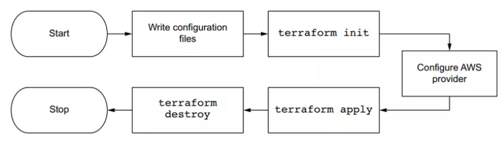
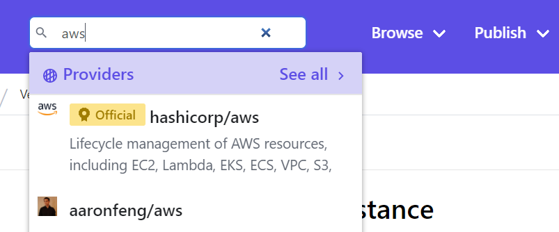
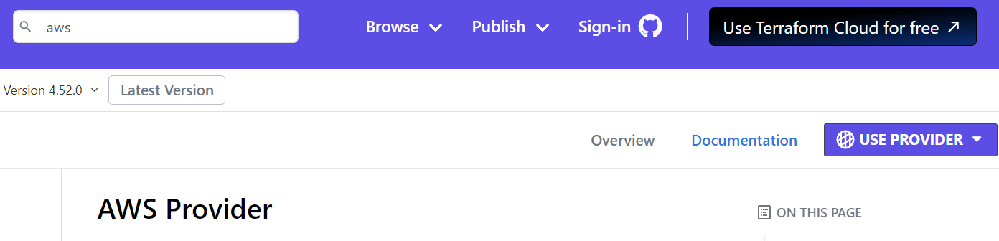
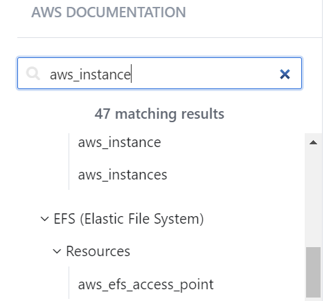

# 1. Terraform
Trong mảng IaC thì tool mà thông dụng nhất ở thời điểm hiện tại chắc có lẽ là Terraform. Terraform là một open-source của HashiCorp, chuyên dùng để provisioning infrastructure, ta chỉ việc viết code, rồi gõ một vài câu CLI đơn giản, nó sẽ tạo ra Infrastructure cho ta, thay vì ta với lên web console bấm rất tốn thời gian.

Flow của terraform sẽ như sau: viết code,gõ lệnh CLI, và đợi nó cung cấp infrastructure, sau khi nó tạo xong thì nó sẽ tạo ra một file state để lưu lại kiến trúc hạ tầng hiện tại.


Cũng có nhiều tool khác có thể làm được việc này như là Ansible chẳng hạn, nhưng Ansible là một Configuration Management tool chứ không phải được tạo ra để tập trung cho mảng IaC, nên dùng nó thì sẽ tốn công chạy những thứ không cần thiết


Để triển khai một ứng dụng thì có thể làm theo flow sau đây, dùng Terraform để tạo hạ tầng, sau đó dùng Ansible để setup những thứ cần thiết cho server, như install docker chẳng hạn, setup CI tool trên server. Sau đó thì dùng docker hoặc kubernetes để chạy ứng dụng.


# 2. Ưu điểm khi dùng terraform

- Dễ sử dụng
- Open source và miễn phí
- Declartive programing: chỉ diễn tả những thứ cần thiết và Teraform làm cho bạn.
- Có thể cung cấp hạ tầng cho nhiều cloud khác nhau như AWS, GCP, Azure trong cùng một file cấu hình, này gọi là Cloud-agnostic

Yêu cầu:
- Có tài khoản AWS
- Tạo IAM user, cấp quyền addmin permission, lấy access key và config vào máy.

Trên máy tính mở Terminal và gõ lệnh sau
``` 
aws config
```
Sau đó nhập accesskey và secretkey của AWS của tài khoản đã tạo vào máy.
## Cài terraform CLI.
https://developer.hashicorp.com/terraform/tutorials/aws-get-started/install-cli>
https://developer.hashicorp.com/terraform/downloads>

# Tạo EC2 bằng Terraform
Ngôn ngữ Terraform sử dụng gọi là HashiCorp Configuration Language (HCL).
Các bước ta thực hiện như sau:

1. Viết terraform file.
2. Cấu hình AWS provider.
3. Khỏi tạo Terraform bằng câu lệnh *terraform init*
4. Triển khai EC2 instance bằng câu lệnh *terraform apply*
5. Xóa EC2 bằng câu lệnh *terraform destroy*



> Tạo file *main.tf*

```
provider "aws" {
  region = "us-east-2"
}
resource "aws_instance" "bai1" {
  ami           = "ami-05bfbece1ed5beb54"
  instance_type = "t2.micro"
  tags = {
    "Name" = "Bai1"
  }
}
```

* Để xem thuộc tính của 1 resource nào đó thì truy cập vào trang
 <https://registry.terraform.io/> để xem




