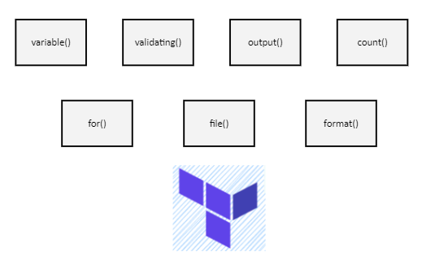
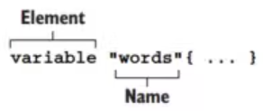
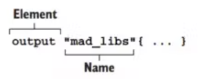
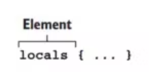

# Terraform functional programming

Terraform hỗ trợ ta lập trình theo cách functional programming


# Provisioning EC2
> Tạo file main.tf 
>
```
provider "aws" {
  region = "us-east-2"
}

data "aws_ami" "ubuntu" {
  most_recent = true

  filter {
    name   = "name"
    values = ["ubuntu/images/hvm-ssd/ubuntu-focal-20.04-amd64-server-*"]
  }

  owners = ["099720109477"]
}

resource "aws_instance" "hello" {
  ami           = data.aws_ami.ubuntu.id
  instance_type = "t2.micro"
}
```
Chạy terraform init và terraform apply, sau đó lên AWS ta sẽ thấy EC2 của ta. Với đoạn code trên thì EC2 luôn luôn có instance_type là t2.micro, và nếu muốn tạo lại EC2 mà sẽ có instance_type khác mạnh hơn thì làm sao? sẽ phải sửa lại code trong file terraform? Vậy thì không linh hoạt cho lắm, mà thay vào đó sẽ sử dụng variable để làm việc này.
## Input variables
Ta có thể định nghĩa variable bên trong terraform, với cú pháp như sau.

Đây là cú pháp variable block để khai báo biến. Ở ví dụ trên, tạo thêm một tệp tin nữa với tên là variable.tf (đặt tên tùy ý) để khai báo biến.
```
variable "instance_type" {
  type = string
  description = "Instance type of the EC2"
}
```
Thuộc tính là type để chỉ định kiểu dữ liệu của biến đó, thuộc tính description dùng để ghi lại mô tả cho người đọc biến đó biết nó có ý nghĩa gì. Chỉ có thuộc tính type là bắt buộc phải khai báo. Trong Terraform thì một biến sẽ có các kiểu dữ liệu sau:

* Basic Type: string, number, bool
* Complex Type: list(), set(), map(), object(), tuple()
> Trong Terraform, kiểu dữ liệu number và bool sẽ được chuyển thành kiểu dữ liệu string khi cần thiết. Nghĩa là 1 sẽ thành "1", true sẽ thành "true".
Ta dùng cú pháp *var.<VARIABLE_NAME>* để truy cập được giá trị của biến, cập nhật lại tệp tin main.tf.
```
provider "aws" {
  region = "us-east-2"
}

data "aws_ami" "ubuntu" {
  most_recent = true

  filter {
    name   = "name"
    values = ["ubuntu/images/hvm-ssd/ubuntu-focal-20.04-amd64-server-*"]
  }

  owners = ["099720109477"]
}

resource "aws_instance" "hello" {
  ami           = data.aws_ami.ubuntu.id
  instance_type = var.instance_type # change here
}
```
Ở thuộc tính *instance_type* thay vì gán mặc đinh thì bây giờ sẽ dùng biến *var.instance_type*
## Gán giá trị cho variable
Để gán giá trị cho biến, tạo file *terraform.tfvars*
```
instance_type = "t2.micro"
```
Khi chạy terraform apply thì tệp tin terraform.tfvars sẽ được Terraform sử dụng để tải giá trị mặc định cho biến, nếu không muốn dùng mặc định,  thì khi chạy lệnh apply thêm vào thuộc tính *-var-file*. Tạo một tệp tin tên là*production.tfvars*
```
instance_type = "t3.small"
```
Khi chạy CI/CD cho production, ta chỉ định tệp tin như sau:
> terraform apply -var-file="production.tfvars"

## Validating variables
Có thể định nghĩa biến này chỉ có thể được gán những giá trị cho phép bằng cách sử dùng thuộc tính validating, như sau:
```
variable "instance_type" {
  type = string
  description = "Instance type of the EC2"

  validation {
    condition = contains(["t2.micro", "t3.small"], var.instance_type)
    error_message = "Value not allow."
  }
}
```
Ở tệp tin trên dùng hàm contains để kiểm tra giá trị của biến *instance_type* này chỉ được nằm trong mảng cho phép, nếu không thì khi chạy câu lệnh apply sẽ thấy lỗi ở trường error_message. Sửa lại tệp tin*terraform.tfvars*
> instance_type = "t3.micro"
Chạy apply
> terraform apply
```
│ Error: Invalid value for variable
│
│   on variable.tf line 1:
│    1: variable "instance_type" {
│
│ Value not allow.
│
│ This was checked by the validation rule at variable.tf:5,3-13.
```
Sử dụng validating để kiểm soát giá trị của biến mà mình muốn.  

## Output
Thông thường khi tạo EC2 xong, ta sẽ muốn xem IP của nó, để làm được việc đó thì ta sử dụng output block.

Giá trị của output block sẽ được in ra Terminal, cú pháp như sau:


Để in được giá trị public_ip của EC2, thêm vào tệp tin main.tf đoạn code sau:


```
output "ec2" {
  value = {
    public_ip = aws_instance.hello.public_ip
  }
}
```
Chạy lệnh *terraform apply* để hiển thị IP của EC2 lên terminal
## Count parameter
Nếu muốn thêm 1 bản EC2 
```
provider "aws" {
  region = "us-east-2"
}

data "aws_ami" "ubuntu" {
  most_recent = true

  filter {
    name   = "name"
    values = ["ubuntu/images/hvm-ssd/ubuntu-focal-20.04-amd64-server-*"]
  }

  owners = ["099720109477"]
}

resource "aws_instance" "hello1" {
  ami           = data.aws_ami.ubuntu.id
  instance_type = var.instance_type
}

resource "aws_instance" "hello2" {
  ami           = data.aws_ami.ubuntu.id
  instance_type = var.instance_type
}

output "ec2" {
  value = {
    public_ip1 = aws_instance.hello1.public_ip
    public_ip2 = aws_instance.hello2.public_ip
  }
}
```
Thêm 1 resource block cho EC2 thứ 2, nhưng nếu muốn tạo 100 con EC2 thì phải sao chép 100 block. Giải pháp là sử dụng thuộc tính count

> Thuộc tính count là một Meta Argument, là một thuộc tính trong Terraform chứ không phải của resource type thuộc Provider, có thể sử dụng nó ở bất kì resource block nào. Cập nhật lại tệp tin main.tf mà sẽ tạo ra 5 EC2.

```
provider "aws" {
  region = "us-east-2"
}

data "aws_ami" "ubuntu" {
  most_recent = true

  filter {
    name   = "name"
    values = ["ubuntu/images/hvm-ssd/ubuntu-focal-20.04-amd64-server-*"]
  }

  owners = ["099720109477"]
}

resource "aws_instance" "hello" {
  count         = 5
  ami           = data.aws_ami.ubuntu.id
  instance_type = var.instance_type
}

output "ec2" {
  value = {
    public_ip1 = aws_instance.hello[0].public_ip
    public_ip2 = aws_instance.hello[1].public_ip
    public_ip3 = aws_instance.hello[2].public_ip
    public_ip4 = aws_instance.hello[3].public_ip
    public_ip5 = aws_instance.hello[4].public_ip
  }
}
```
Ở phần output, để truy cập được resource thì dùng dấu [] và giá trị Index của resource. Bình thường để truy cập được resource dùng theo cú pháp \<RESOURCE TYPE>.\<NAME>, nhưng khi dùng count thì sẽ truy cập resource theo cú pháp \<RESOURCE TYPE>.\<NAME>[index].

## For expressions
For cho phép duyệt qua một danh sách, cú pháp của lệnh for:

> for \<value> in \<list> : \<return value>

Ví dụ dùng for:

* Tạo ra một mảng mới với giá trị của mảng mới sẽ được viết hoa: [for s in var.words : upper(s)]
* Tạo ra một đối tượng mới với giá trị của đối tượng mới được viết hoa: { for k, v in var.words : k => upper(s) }
* Ta sẽ dùng for để rút gọn phần output của EC2. Cập nhật lại tệp tin main.tf

```
output "ec2" {
  value = {
    public_ip = [ for j in aws_instance.hello : j.public_ip ]
  }
}
```
Phần output trên sẽ in ra giá trị public_ip là một mảng IP của tất cả EC2 được tạo ra. Còn nếu muốn in output ra theo kiểu { public_ip1: \<value>, public_ip2: \<value> } thì có thể dùng hàm format.
## Format function

```
output "ec2" {
  value = { for i, j in aws_instance.hello : format("public_ip%d", i + 1) => j.public_ip }
}
```
> Chạy *terraform* plan để kiểm tra ta sẽ thấy output lúc này sẽ là dạng { public_ip1: \<value>, public_ip2: \<value> }.

```
...
Changes to Outputs:

* ec2 = {
  * public_ip1 = (known after apply)
  * public_ip2 = (known after apply)
  * public_ip3 = (known after apply)
  * public_ip4 = (known after apply)
  * public_ip5 = (known after apply)
    }

────────────────────────────────────────────────────────────────────────────────────────────────────────────────────────────

Note: You didn't use the -out option to save this plan, so Terraform can't guarantee to take exactly these actions if you
run "terraform apply" now.
```
# Provisioning S3
```
terraform {
  required_providers {
    aws = {
      source = "hashicorp/aws"
      version = "4.52.0"
    }
  }
}

provider "aws" {
  region = "us-east-2"
}

resource "aws_s3_bucket" "static" {
  bucket        = "terraform-series-bai3-20230202"
  force_destroy = true

  tags = local.tags
}

resource "aws_s3_bucket_acl" "static" {
  bucket = aws_s3_bucket.static.id
  acl    = "public-read"
}

resource "aws_s3_bucket_website_configuration" "static" {
  bucket = aws_s3_bucket.static.bucket

  index_document {
    suffix = "index.html"
  }

  error_document {
    key = "error.html"
  }
}

data "aws_iam_policy_document" "static" {
  statement {
    actions   = ["s3:GetObject"]
    resources = ["${aws_s3_bucket.static.arn}/*"]

    principals {
      type = "*"
      identifiers = ["*"]
    }
  }
}

resource "aws_s3_bucket_policy" "static" {
  bucket = aws_s3_bucket.static.id
  policy = data.aws_iam_policy_document.static.json
}
```
Chạy *terraform init* và *terraform apply*, sẽ thấy S3 Bucket của ta trên AWS.


## File function
Hàm file sẽ giúp ta tải nội dung của một tệp tin nào đó vào bên trong Terraform. Tạo một tệp tin tên là *s3_static_policy.json* và sao chép đoạn JSON trên vào.
```
{
  "Version": "2012-10-17",
  "Statement": [
    {
      "Sid": "PublicReadGetObject",
      "Effect": "Allow",
      "Principal": "*",
      "Action": [
        "s3:GetObject"
      ],
      "Resource": [
        "arn:aws:s3:::terraform-series-bai3-20230202/*"
      ]
    }
  ]
}
```

>Cập nhật lại main.tf.
```
terraform {
  required_providers {
    aws = {
      source = "hashicorp/aws"
      version = "4.52.0"
    }
  }
}

provider "aws" {
  region = "us-east-2"
}

resource "aws_s3_bucket" "static" {
  bucket        = "terraform-series-bai3"
  force_destroy = true

  tags = local.tags
}

resource "aws_s3_bucket_acl" "static" {
  bucket = aws_s3_bucket.static.id
  acl    = "public-read"
}

resource "aws_s3_bucket_website_configuration" "static" {
  bucket = aws_s3_bucket.static.bucket

  index_document {
    suffix = "index.html"
  }

  error_document {
    key = "error.html"
  }
}

resource "aws_s3_bucket_policy" "static" {
  bucket = aws_s3_bucket.static.id
  policy = file("s3_static_policy.json")
}
```
Khi ta dùng S3 ở chế độ Static Website, thì URL của trang web của ta sẽ có định dạng *<http://\<bucket-name>.s3-website-\<region>.amazonaws.com>*.

Tiếp theo tải tệp tin lên S3 Bucket để hosting trang web của ta. Tải source code ở đây , sau khi tải xong thì nhớ xóa tệp .git đi.

Để tải tệp tin lên S3, dùng AWS CLI.

> aws s3 cp static-web s3://terraform-series-bai3-20230202 --recursive


### Tải tệp tin lên S3 bằng Terraform
Để tải tệp tin lên S3 thì dùng resource là *aws_s3_object*. Cập nhật lại tệp tin main.tf
```
terraform {
  required_providers {
    aws = {
      source = "hashicorp/aws"
      version = "4.52.0"
    }
  }
}

provider "aws" {
  region = "us-east-2"
}

resource "aws_s3_bucket" "static" {
  bucket        = "terraform-series-bai3-20230202"
  force_destroy = true

  tags = local.tags
}

resource "aws_s3_bucket_acl" "static" {
  bucket = aws_s3_bucket.static.id
  acl    = "public-read"
}

resource "aws_s3_bucket_website_configuration" "static" {
  bucket = aws_s3_bucket.static.bucket

  index_document {
    suffix = "index.html"
  }

  error_document {
    key = "error.html"
  }
}

resource "aws_s3_bucket_policy" "static" {
  bucket = aws_s3_bucket.static.id
  policy = file("s3_static_policy.json")
}

locals {
  mime_types = {
    html  = "text/html"
    css   = "text/css"
    ttf   = "font/ttf"
    woff  = "font/woff"
    woff2 = "font/woff2"
    js    = "application/javascript"
    map   = "application/javascript"
    json  = "application/json"
    jpg   = "image/jpeg"
    png   = "image/png"
    svg   = "image/svg+xml"
    eot   = "application/vnd.ms-fontobject"
  }
}

resource "aws_s3_object" "object" {
  for_each = fileset(path.module, "static-web/**/*")
  bucket = aws_s3_bucket.static.id
  key    = replace(each.value, "static-web", "")
  source = each.value
  etag         = filemd5("${each.value}")
  content_type = lookup(local.mime_types, split[".", each.value](length(split(".", each.value)) - 1))
}
```

## Fileset function
Ví dụ: có thư mục như sau:

```.
├── index.html
├── index.css
```
Thì khi dùng hàm fileset(path.module, "*") sẽ có được data set như sau:
```
{
  "index.html": "index.html",
  "index.css" : "index.css"
}
```
Với giá trị key và value là tên của tệp tin. Ở trên, dùng hàm fileset và aws_s3_object resource để tải toàn bộ tệp tin trong thư mục static-web lên trên S3.

## Locals block
Có một block nữa tên là locals, đây là block giúp khai báo một giá trị local trong tệp tin Terraform và có thể sử dụng lại được nhiều lần. Cú pháp như sau:



Không giống như variable block, cần phải khai báo kiểu dữ liệu thì locals block sẽ gán thẳng giá trị cho nó. Ví dụ như sau:
```
locals {
  one = 1
  two = 2
  name = "max"
  flag = true
}
```
Để truy cập giá trị local thì dùng cú pháp *local.<KEY>*, ví dụ:

local.one
