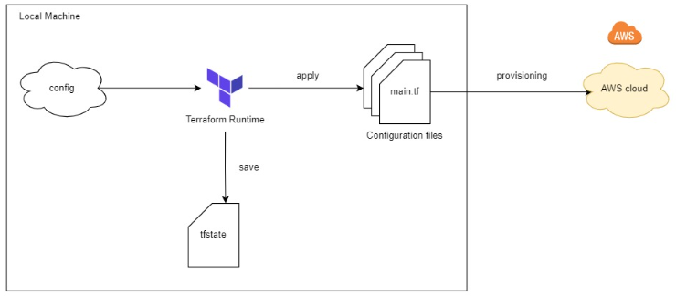
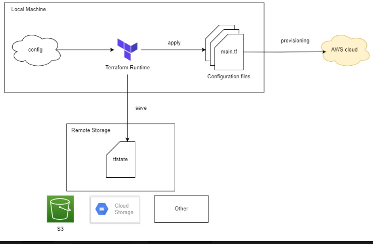
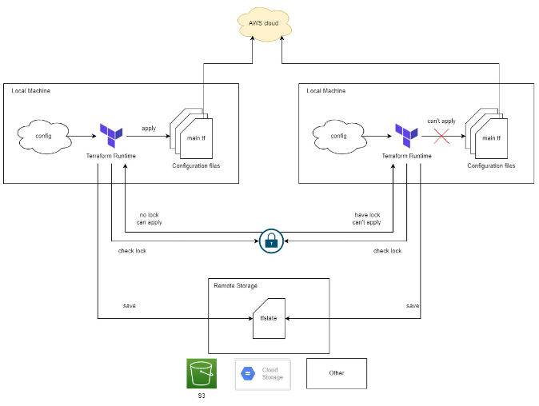
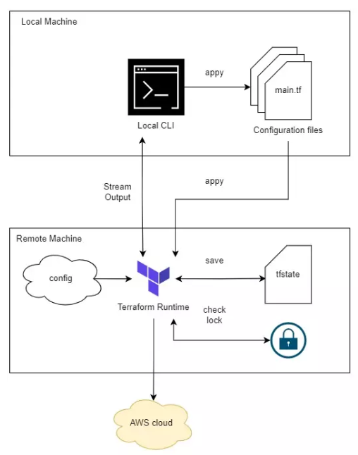
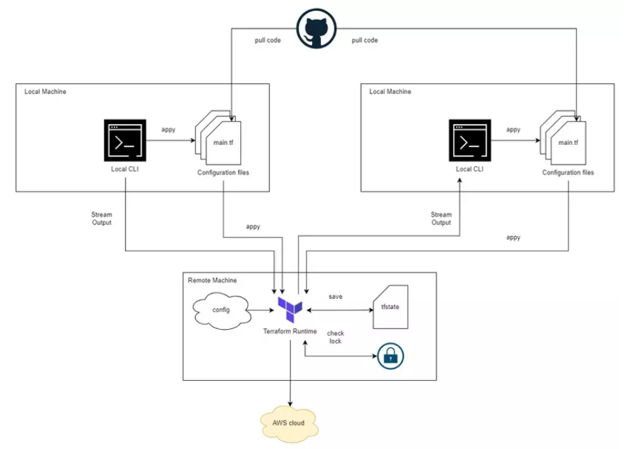
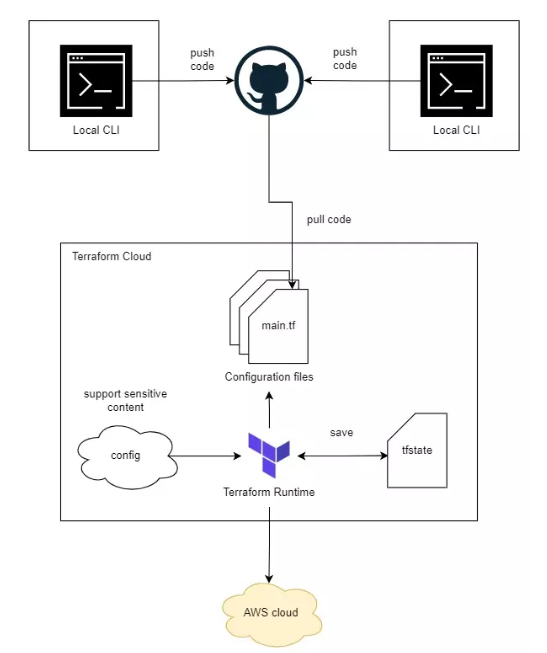

Khi chúng ta làm việc với *Terraform*, nếu chỉ có một mình thì mọi chuyện không có gì xảy ra, nhưng nếu làm việc theo team để viết *terraform file* thì có nhiều vấn đề xảy ra. 
- Làm sao để có thể share source code với nhau và làm sao share terraform state, khi chạy lệnh *apply* thì terraform chạy xong thì nó sẽ lưu cấu hình hệ thống vào state file.
* Cách thường dùng là push lên github và để người khác pull xuống. Nhưng nếu dùng github để lưu và share state file thì mỗi lần apply xong thì phải push lên và các thành viên khác phải pull xuống trước khi họ chạy apply. Nếu dùng như vậy rất dễ gây ra conflict.
- Nếu cùng lúc có 2 người chạy apply thì hạ tầng sẽ ra sao?
=> Để giải quyết vấn đề trên ta dùng 1 feature của terraform là Backend
# Terraform Backend
> Một backend trong terraform sẽ đóng vai trò quyết định state file được lưu ở đâu và Terraform CLI operations như *terraform plan* hoặc *terraform apply* sẽ chạy như thế nào. Trong terraform có 3 loại backend:
-   Local backend
-   Standard backend
-   Remote backend(enhanced backend)

## Local backend
Đây là backend măc định khi chạy terraform. Terraform Runtime sẽ được thực thi ở máy local và sau khi chạy xong thì nó sẽ lưu kết quả dưới dạng state file.

## Standard backend
Ở loại backend này thì terraform runtime vẫn được thực thi ở máy local, nhưng sau khi chạy xong thì kết quả sẽ được lưu ở nơi khác(remote state file). Nơi lưu trữ state file có thể là AWS S3, GPC cloud storage,...

 Lúc này ta có thể lưu source trên github
 
 Ngoài việc lưu trữ state file thì standard backend còn hỗ trợ cho ta 1 feature là lock remote state file. Khi một user chạy câu lệnh *terraform apply* thì terraform sẽ lock lại file state. Nếu có một người khác cùng lúc đó chạy lệnh terraform thì terraform kiểm tra thấy state file đã bị lock thì nó sẽ reject câu lệnh terraform apply của user thứ 2
 => Giải quyết vấn đề nhiều người cùng lúc chạy lệnh *terraform apply*
 

 - Ngoài ra khi sử dụng standard backen thì có thể tăng độ bảo mật lên một chút, vì cấu hình hạ tầng mà liên quan tới database như password thì nó sẽ lưu ở remote state file, không phải ai cũng có thể vào remote state file để xem được.

Ví dụ: sử dụng S3 standard backend config như sau
~~~
terraform {
    backend "S3" {
        bucket = "state-bucket"
        key = "team/rocket"
        region = "us-east-1"
        encrypt = true
        role_arn = "arn:aws:iam::<ACCOUNT_ID>:role/state-bucket-assume-role"
        dynamodb_table = "state-assume-lock"
    }
    required_version ">= 0.15"
    required_providers {
        null = {
            source = "hashicorp/null"
            version = "~> 3.0"
        }
    }
}
~~~

> Nhưng vấn đề là những config yêu cầu để chạy terraform vẫn phải lưu ở local. Ví dụ khi chạy terraform để tạo hạ tầng trên AWS, ta vẫn phải cấu hình secret key ở máy local, và cho tiện thì mọi người đều tạo admin account mà có full quyền AWS, sau đó lưu secret key ở local -> không bảo mật

### Remote backend
Terraform runtime sẽ được thực thi ở remote server, và Terraform CLI ở máy local chỉ có nhiệm vụ streaming kết quả được in ra từ remote server về local CLI của ta. Và sau khi nó chạy xong, state file cũng sẽ được lưu trữ ở remote server.

Lúc này cả config file và state file đều được lưu ở remote server. Remote backend cũng có tính năng lock state file để ngăn chặn việc nhiều người chạy apply cùng lúc.

Ví dụ khi dùng remote backend thì ta sẽ config như sau.
~~~
terraform {
  backend "remote" {
    hostname = "app.terraform.io"
    organization = "hpi"

    workspaces {
      name = "pro"
    }
  }
}

~~~

Dùng remote backend khi làm việc với team và sử dụng remote backend ta có thể centralize tất cả config ở cùng một chỗ
Ngoài việc lựa chọn backend cho terraform, khi làm thực tế ta cũng thường phải xây dựng CI/CD cho một terraform project. Để làm CI/CD cho terraform cũng khá mất thời gian nên để tiết kiệm thời gian ta có thể xài một platform có sẵn của Terraform là Terraform Cloud.

## Terraform Cloud
Đây là một platform được Hashicorp (công ty phát triển Terraform) xây ra. Nó sẽ hỗ trợ ta trong việc sử dụng Terraform một cách rất dễ dàng.
Khi dùng Terraform Cloud thì, chỉ cần viết code và push lên github, Terraform Cloud sẽ pull code xuống và chạy.

# 
