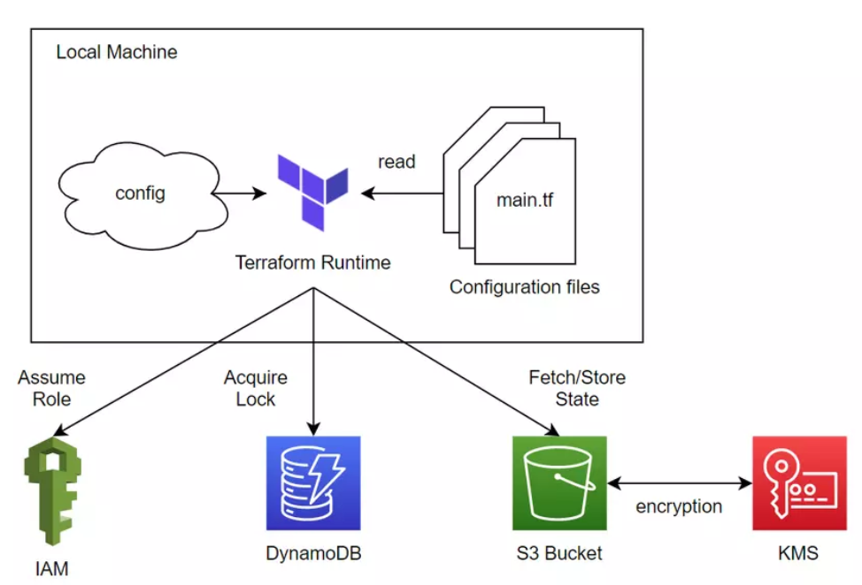
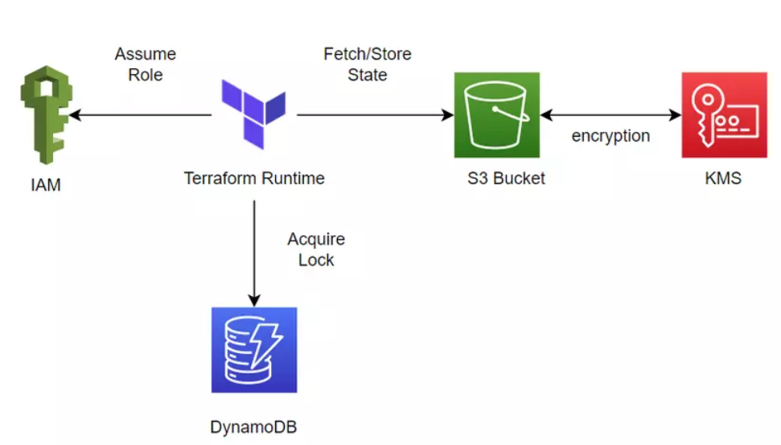

# Developing an S3 backend

## Architecture
Trước khi sử dụng S3 Backend thì ta cần phải tạo nó trước, cấu trúc của một S3 Backend gồm những thành phần:

- IAM
- DynamoDB
- S3 bucket - KMS

Từng thành phần trên sẽ được sử dụng như sau:

- IAM được sử dụng để terraform assume role, để terraform có quyền ghi vào dynamodb table và fetch/store state vào bên trong S3.
- Dynamodb được terraform dùng để ghi lock key của một process vào bên trong nó, vì dynamodb có tốc độ đọc và ghi nhanh tới mức milisecond nên nó rất thích hợp để lock state của một process.
- S3 bucket dùng để lưu trữ state khi terraform chạy xong, KMS được S3 sử dụng để mã hóa dữ liệu state khi nó được lưu vào bên trong S3.
## Developing
Giờ thì ta sẽ tiến hành tạo S3 backend, phía dưới các resource mà ta sẽ sử dụng để tạo S3 backend.
