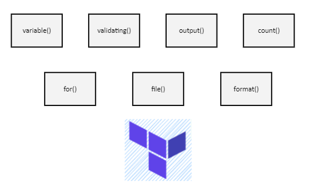

# Terraform functional programming

Terraform hỗ trợ ta lập trình theo cách functional programming

# Provisioning EC2
## Input variables
## Gán giá trị cho variable
## Validating variables
## Output
## Count parameter
## For expressions
## Format function
# Provisioning S3
## File function
## Fileset function
## Local values
